[*← Back to index*](../../README.md)

# Cap

This Write-up/Walkthrough provides my process for the **Cap** *(HTB)* CTF. Here you will find the solution for the machine. I encourage you to use this as a reference, not a direct solution.

---

## Scan

So I started with the nmap scan:

```
nmap -p- --open --min-rate 5000 -sS -Pn -n -vvv 10.129.56.222
PORT   STATE SERVICE REASON
21/tcp open  ftp     syn-ack ttl 63
22/tcp open  ssh     syn-ack ttl 63
80/tcp open  http    syn-ack ttl 63
```

```
nmap -p21,22,80 -sV -sC 10.129.56.222
PORT   STATE SERVICE VERSION
21/tcp open  ftp     vsftpd 3.0.3
22/tcp open  ssh     OpenSSH 8.2p1 Ubuntu 4ubuntu0.2 (Ubuntu Linux; protocol 2.0)
| ssh-hostkey: 
|   3072 fa:80:a9:b2:ca:3b:88:69:a4:28:9e:39:0d:27:d5:75 (RSA)
|   256 96:d8:f8:e3:e8:f7:71:36:c5:49:d5:9d:b6:a4:c9:0c (ECDSA)
|_  256 3f:d0:ff:91:eb:3b:f6:e1:9f:2e:8d:de:b3:de:b2:18 (ED25519)
80/tcp open  http    Gunicorn
|_http-server-header: gunicorn
|_http-title: Security Dashboard
Service Info: OSs: Unix, Linux; CPE: cpe:/o:linux:linux_kernel
```

So there are 3 open ports:
- **21**: FTP
- **22**: SSH
- **80**: HTTP → Gunicorn (Python)

```
whatweb http://cap.htb
http://cap.htb [200 OK] Bootstrap, Country[RESERVED][ZZ], HTML5, HTTPServer[gunicorn], IP[10.129.56.222], JQuery[2.2.4], Modernizr[2.8.3.min], Script, Title[Security Dashboard], X-UA-Compatible[ie=edge]
```

---

## Pasive recognition

Port 80 is a server running with `python` via **gunicorn**; it also uses a JavaScript library named **mordernizr**, let's take a look at the webpage:

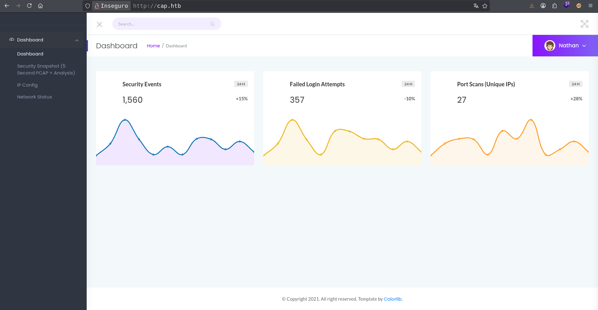

If we look at the source code, we'll find that there are several paths for `CSS` and `JavaScript` files. If we navigate through the menu on the left, we'll see the following:

• Security Snapshot:

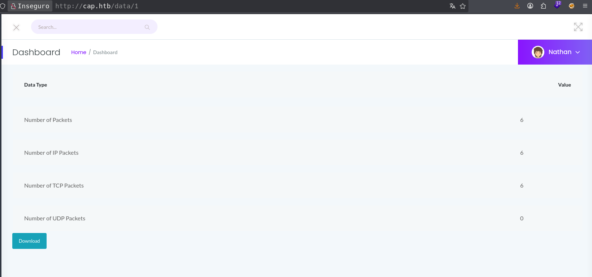

• IP Config:

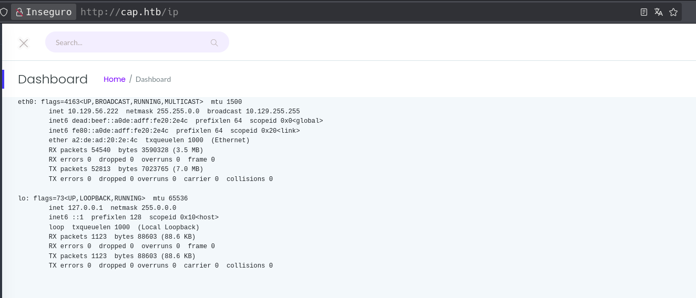

• Netstat

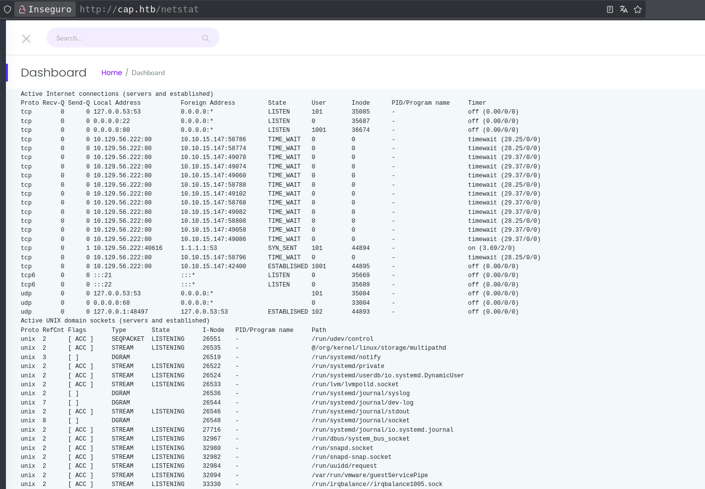

Great, here we can see some interesting things:

  1. The **ipconfig** and **netstat** sections seem to be displayed the same information as their Linux counterparts: `ifconfig` and `netstat`, respectively (note that the `netstat` is a bit outdated, and it's recommended to use `ss` instead).
  2. There are `.pcap` files being loaded at the path: `http://cap.htb/data/<pcap-file>`.
  3. The user menu in the upper right corner isn't very useful, so we won't consider it for now.

Given the point 2 above, we're at a crossroad: we need to find the correct .pcap file and read its contents to access either for port 21 (FTP) or port 22 (SSH). Personally, I'm not satisfied with the three shown, so I'm going to the .pcap file 0:

`http://cap.htb/data/0`

I download it and open it in `wireshark`

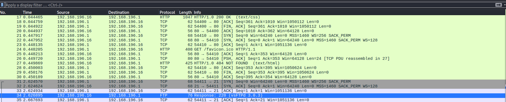

We can see three protocols: HTTP, TCP, FTP. I took a quick the HTTP protocol and didn't find anything interesting, but the FTP contains the credentials needed to access the FTP port, so we'll check that out after downloading the other files and see if we can extract any information.

So I downloaded the four files, numbered 0 through 3. And here's what I found:

- Files 2-3: Empty
- File 0: FRP credentials with the username we already have on the website.
- File 1: This is our TCP log, specifically from our attacker machine with our IP address. I think that in the future, if we access the remote host, we should delete this file because it indicates that we were there.

For now, this is the information we can extract. Let's move on to the FTP service.

---

## Active recognition

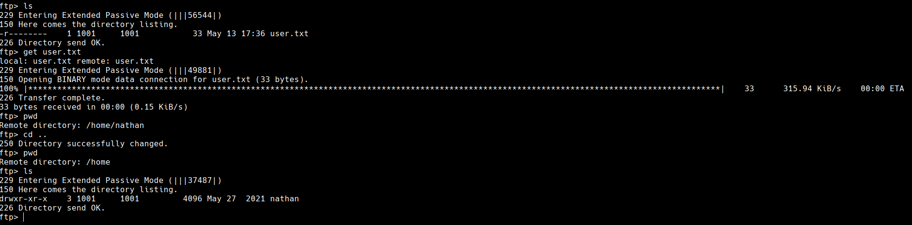

We found the first flag. After taking a closer look, this port is wide open, but I still couldn't get very far. Out of curiosity, I tried the same credentials for SSH and it worked:

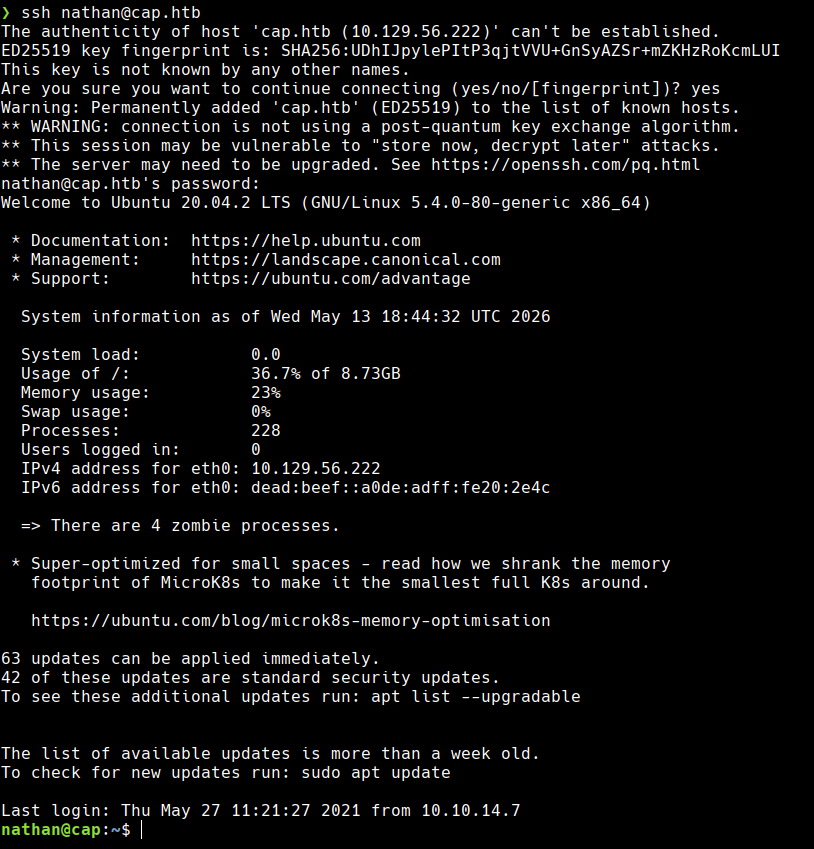

Let's take a look at the basic information:

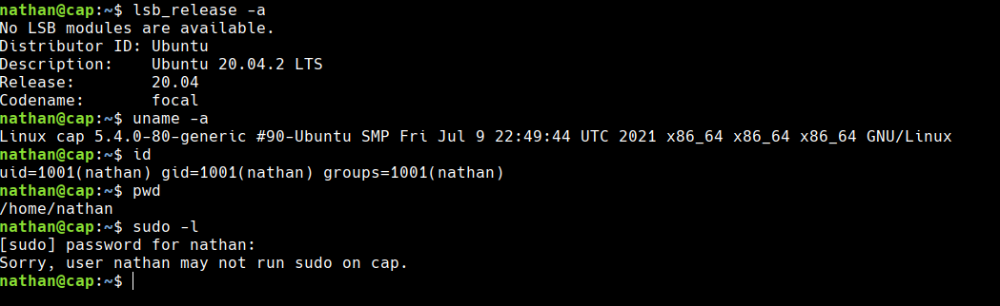

Great, it won't let us use `sudo` here, but we can still figure out which files we can use as superuser:

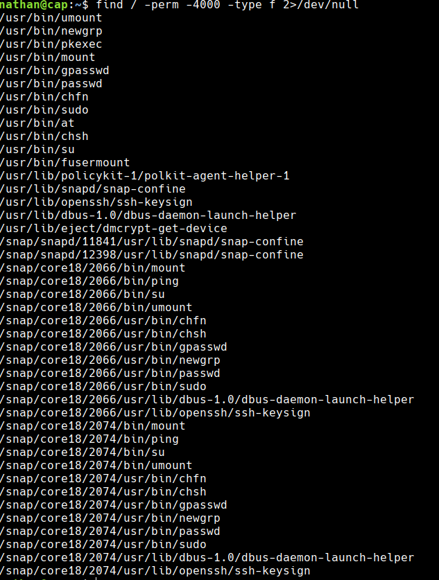

First I try to see if I can exploit any of the binaries using GTFObins, but none of them work. However, I looked through the **crontabs**, **passwd** and there isn't much of interest there. At this point, I decided to save time and go to the server on port 80 to see if I can delete our trace from the `.pcap` file, and I'm in for a surprise: the directory belongs to this user:

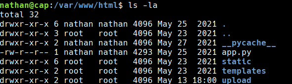

So I think: If we have access to it and can write Python scripts, we can launch a shell, let's see what happens:

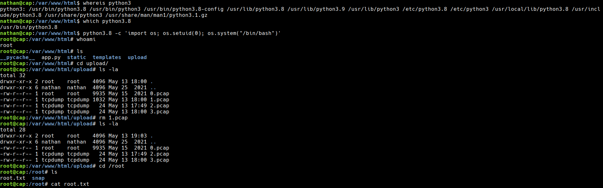

Great, We did it! We've created a shell and cleared our request history from the `.pcap` file.

Reviewing other write-ups for this machine, I noticed most rely on LINPEAS to identify the Python capability abuse. While LINPEAS is a powerful tool, in a real engagement it generates considerable noise. A manual, low-profile enumeration was sufficient here to reach the same conclusion without alerting any monitoring system.

[*← Back to index*](../../README.md)