[*← Back to index*](../../README.md)

# IDE

This Write-up/Walkthrough provides my process for the **IDE** *(THM)* CTF. Here you will find the solution for the machine. I encourage you to use this as a reference, not a direct solution.

---

## Scan

As I ever do, let's start with the respective scan:

```bash
nmap -p- --open --min-rate 5000 -sS -Pn -n 10.112.181.243

  21/tcp    open  ftp
  22/tcp    open  ssh
  80/tcp    open  http
  62337/tcp open  unknown

###

nmap -p21,22,80,62337 -sV -sC 10.112.181.243 

21/tcp    open  ftp     vsftpd 3.0.3
|_ftp-anon: Anonymous FTP login allowed (FTP code 230)
| ftp-syst: 
|   STAT: 
| FTP server status:
|      Connected to ::ffff:192.168.136.26
|      Logged in as ftp
|      TYPE: ASCII
|      No session bandwidth limit
|      Session timeout in seconds is 300
|      Control connection is plain text
|      Data connections will be plain text
|      At session startup, client count was 2
|      vsFTPd 3.0.3 - secure, fast, stable
|_End of status
22/tcp    open  ssh     OpenSSH 7.6p1 Ubuntu 4ubuntu0.3 (Ubuntu Linux; protocol 2.0)
| ssh-hostkey: 
|   2048 e2:be:d3:3c:e8:76:81:ef:47:7e:d0:43:d4:28:14:28 (RSA)
|   256 a8:82:e9:61:e4:bb:61:af:9f:3a:19:3b:64:bc:de:87 (ECDSA)
|_  256 24:46:75:a7:63:39:b6:3c:e9:f1:fc:a4:13:51:63:20 (ED25519)
80/tcp    open  http    Apache httpd 2.4.29 ((Ubuntu))
|_http-server-header: Apache/2.4.29 (Ubuntu)
|_http-title: Apache2 Ubuntu Default Page: It works
62337/tcp open  http    Apache httpd 2.4.29 ((Ubuntu))
|_http-title: Codiad 2.8.4
|_http-server-header: Apache/2.4.29 (Ubuntu)
Service Info: OSs: Unix, Linux; CPE: cpe:/o:linux:linux_kernel
```

I found 4 ports opened:

  * **21**: FTP
  * **22**: SSH
  * **80**: HTTP → Apache httpd 2.4.29
  * **62337**: HTTP → Apache httpd 2.4.29 (Codiad 2.8.4)

---

## Pasive Recognition

```bash
whatweb 10.112.181.243

  ERROR Opening: https://10.112.181.243 - Connection refused - connect(2) for "10.112.181.243" port 443
  http://10.112.181.243 [200 OK] Apache[2.4.29], Country[RESERVED][ZZ], HTTPServer[Ubuntu Linux][Apache/2.4.29 (Ubuntu)], IP[10.112.181.243], Title[Apache2 Ubuntu Default Page: It works]
```

Ok, so we go to the website running on port 62337:

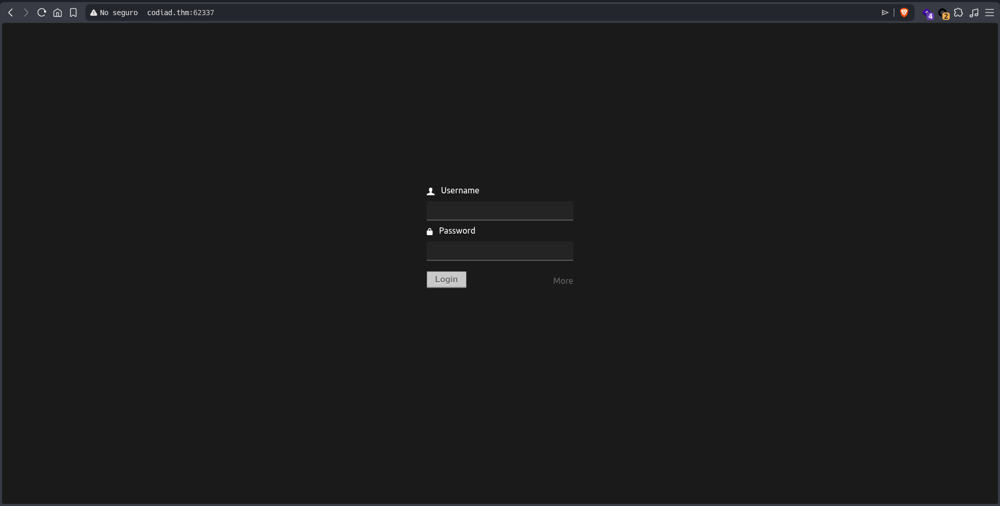

We found a Log-in form. We pause just here. Do you remember that we found port 21 (FTP) opened? Also it allows to get in as "Anonymous", let's find out

```bash
ftp 10.112.181.243 21

Connected to 10.112.181.243.
220 (vsFTPd 3.0.3)
Name (10.112.181.243:User): Anonymous
331 Please specify the password.
Password: 
230 Login successful.
Remote system type is UNIX.
Using binary mode to transfer files.
ftp> ls
229 Entering Extended Passive Mode (|||13637|)
150 Here comes the directory listing.
226 Directory send OK.
ftp> ls -la
229 Entering Extended Passive Mode (|||5976|)
150 Here comes the directory listing.
drwxr-xr-x    3 0        114          4096 Jun 18  2021 .
drwxr-xr-x    3 0        114          4096 Jun 18  2021 ..
drwxr-xr-x    2 0        0            4096 Jun 18  2021 ...
226 Directory send OK.
ftp> cd ...
250 Directory successfully changed.
ftp> ls -la
229 Entering Extended Passive Mode (|||32084|)
150 Here comes the directory listing.
-rw-r--r--    1 0        0             151 Jun 18  2021 -
drwxr-xr-x    2 0        0            4096 Jun 18  2021 .
drwxr-xr-x    3 0        114          4096 Jun 18  2021 ..
226 Directory send OK.
ftp> get \-
local: - remote: -
229 Entering Extended Passive Mode (|||45428|)
150 Opening BINARY mode data connection for - (151 bytes).
100% |************************************************************************************************************************************************|   151        1.56 MiB/s    00:00 ETA
226 Transfer complete.
151 bytes received in 00:00 (1.64 KiB/s)
```

Nice, we got a file, let's find out what it is:

```bash
mv ./- file

wc -l file
5 file
```

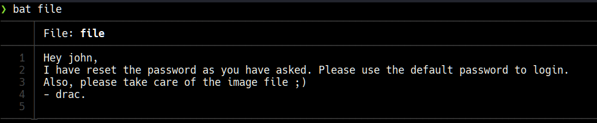

Nice, so we have some critical information:

  * **John** as username
  * **drac** as username

I tried hydra in the form looking for any password:

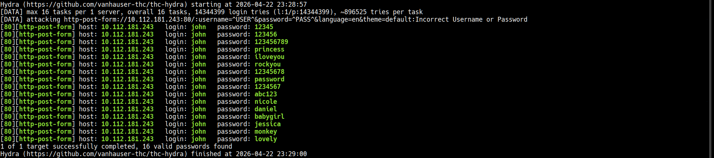

Sadly, none of them worked, then I read the file carefully again and tried "default" and "password" (they were right in front of me whole time).

We get in:

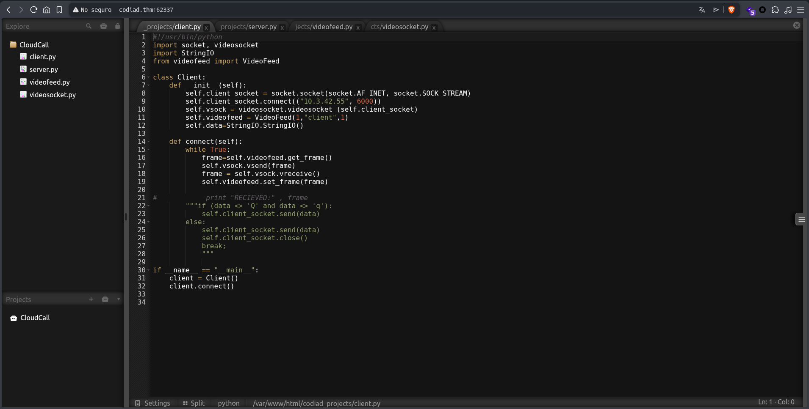

Since I'm not familiar with this Python modules, I'm guessing we're dealing with some kind of videocamera, however, looking through IDE (as the challenge name suggest) I found a "Help" section that leads to a Github repository — we're dealing with a web-based IDE.

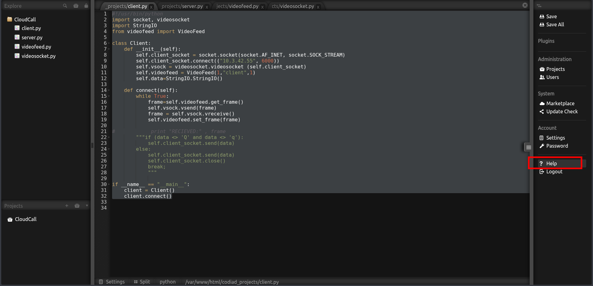

The next thing I do is search for "Codiad exploits"

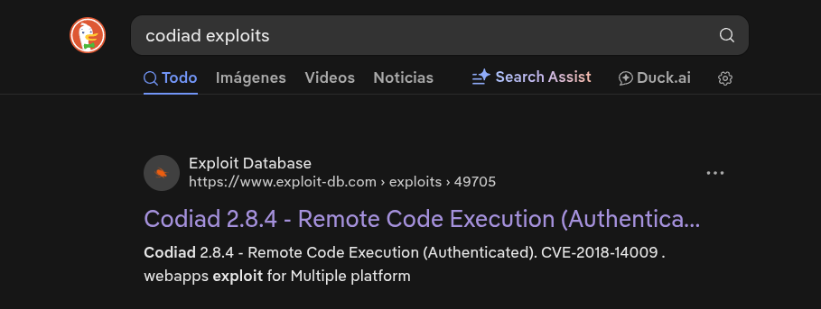
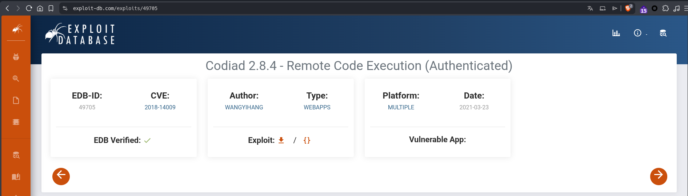

The exploit offers RCE, so let's get started:

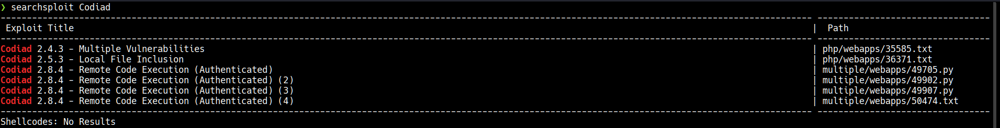

```bash
searchsploit -m multiple/webapps/49705.py

    Exploit: Codiad 2.8.4 - Remote Code Execution (Authenticated)
        URL: https://www.exploit-db.com/exploits/49705
       Path: /usr/share/exploitdb/exploits/multiple/webapps/49705.py
      Codes: CVE-2018-14009
   Verified: True
  File Type: Python script, ASCII text executable
```

---

## Active Recognition

We start with the exploitation:

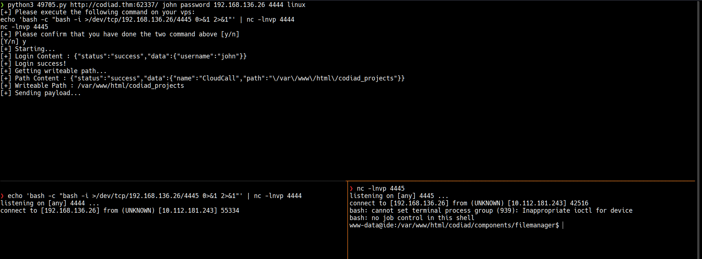

Perfect, we're inside. After looking for a while I found credentials in `/home/drac/.bash_history`

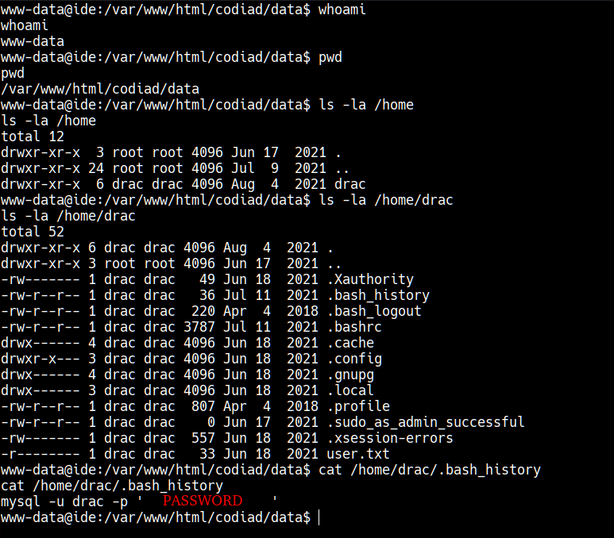

I tried the credentials in SSH service (port 22) and it works (it was a bit easy):

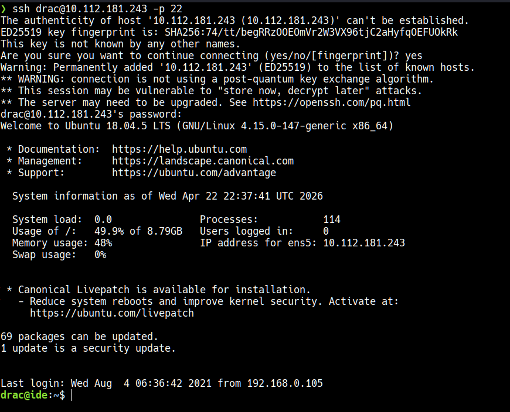

We found the first flag:

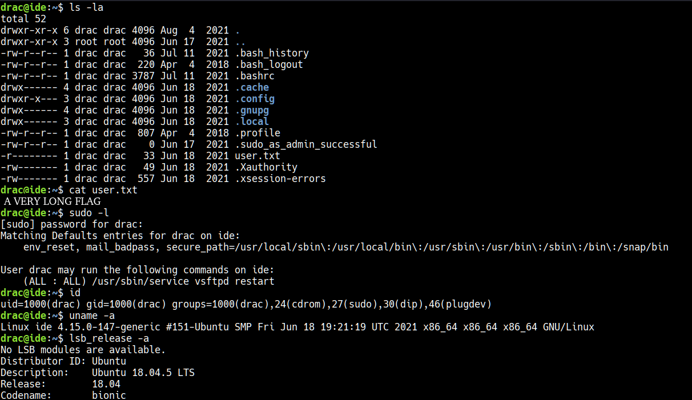

As we can see in the image above, we have sudo access to the service `/usr/bin/service vsftpd restart`. I tried to find something easier to scale privileges but couldn't find anything, so I searched online and found the following:

https://offsec.pentest.tools/exploit/linux/privilege-escalation/sudo/sudo-service-privilege-escalation/

That page explains exactly how to create a revershe shell to gain root access.

Finally, we get the root flag:

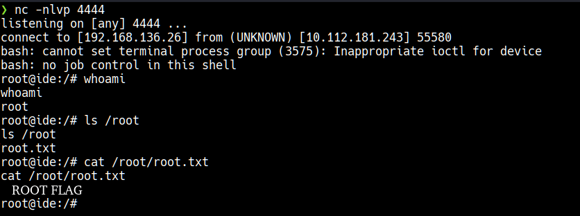

[*← Back to index*](../../README.md)