[*← Back to index*](../../README.md)

# The Sticker Shop

This Write-up/Walkthrough provides my process for the **The Sticker Shop** *(THM)* CTF. Here you will find the solution for the machine. I encourage you to use this as a reference, not a direct solution.

---

## Scan

As usual, let's start with the scans:

```
nmap -p- --open --min-rate 5000 -sS -Pn -n -vvv 10.112.145.255

  22/tcp   open  ssh        syn-ack ttl 62
  8080/tcp open  http-proxy syn-ack ttl 62
```

```
nmap -p22,8080 -sC -sV 10.112.145.255 -oN target

  PORT     STATE SERVICE VERSION
  22/tcp   open  ssh     OpenSSH 8.2p1 Ubuntu 4ubuntu0.13 (Ubuntu Linux; protocol 2.0)
  | ssh-hostkey: 
  |   3072 7b:f0:28:c6:28:ce:36:fd:cf:09:f0:e8:15:c4:1b:e5 (RSA)
  |   256 21:57:d8:23:a9:45:65:ab:31:ea:0d:35:1b:41:ed:be (ECDSA)
  |_  256 1f:b9:7a:a2:15:c1:5d:59:9f:ff:c0:dd:93:3c:d7:0d (ED25519)
  8080/tcp open  http    Werkzeug httpd 3.0.1 (Python 3.8.10)
  |_http-server-header: Werkzeug/3.0.1 Python/3.8.10
  |_http-title: Cat Sticker Shop
  Service Info: OS: Linux; CPE: cpe:/o:linux:linux_kernel
```

I found 2 ports opened:

  * **22**: SSH
  * **8080**: HTTP → Werkzeug 3.0.1 (Python 3.8.10)

---

## Pasive Recognition

I usually use `whatweb` before visiting the website to learn a little about backend, frontend, libraries, frameworks, etc:

```
whatweb 10.112.145.255:8080

  http://10.112.145.255:8080 [200 OK] Country[RESERVED][ZZ], HTML5, HTTPServer[Werkzeug/3.0.1 Python/3.8.10], IP[10.112.145.255], Python[3.8.10], Title[Cat Sticker Shop], Werkzeug[3.0.1]
```

Perfect, let's go visit the website

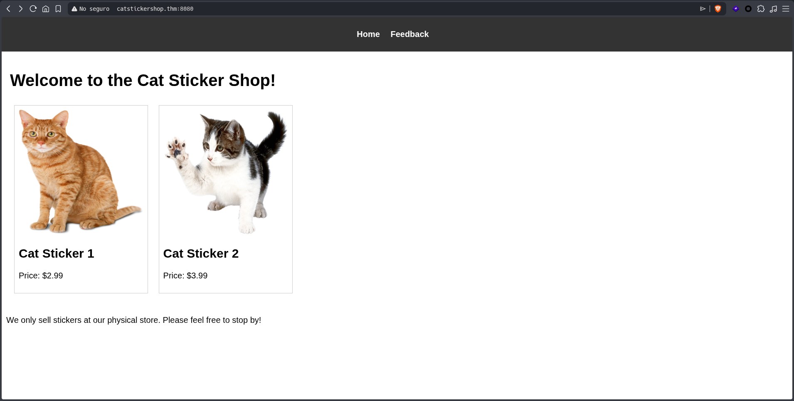

The challenge instructions says:

> "Can you read the flag at `http://10.112.145.255:8080/flag.txt` (opens in new tab)?"

But if we go to the URL:

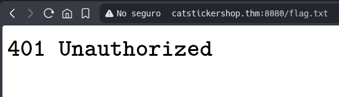

Back on the home page, there is a section labeled "Feedback" that take us to the following URL: `/submit_feedback`

At first glance, it's a pretty simple POST request. Let's open `Burpsuite`:

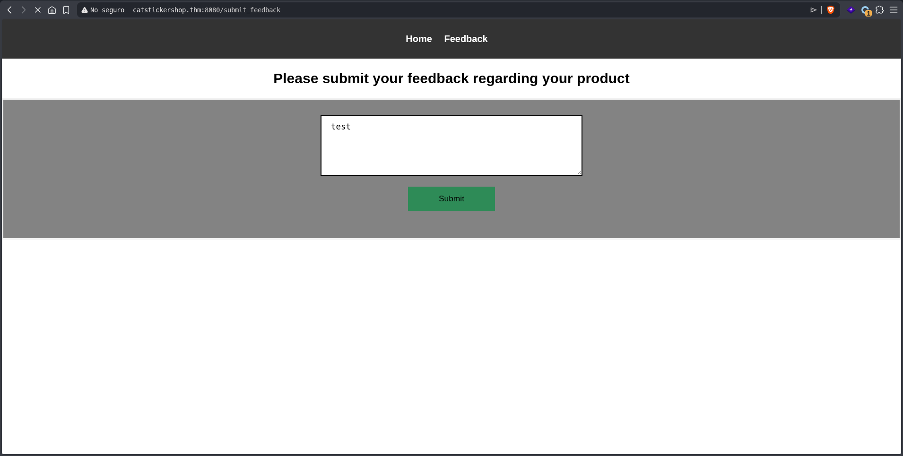
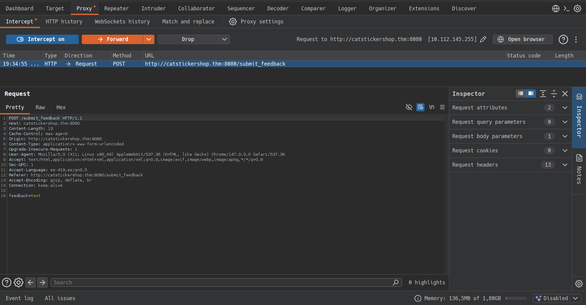
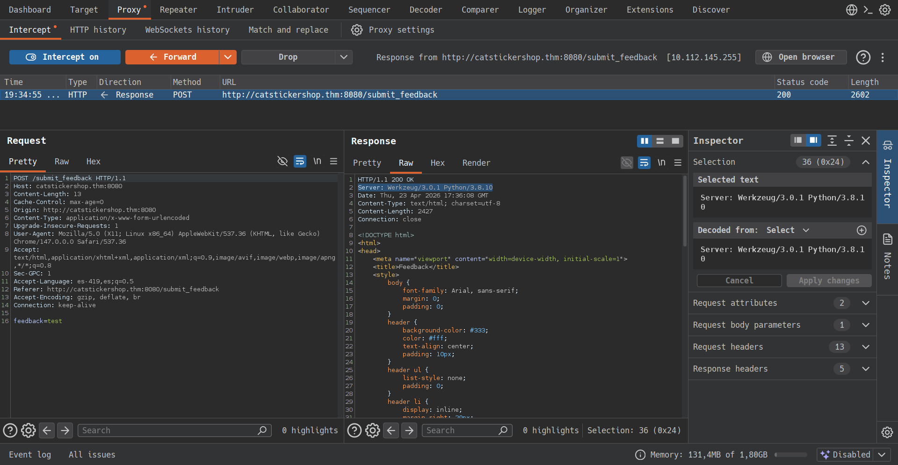

Honestly, there's nothing interesting about it...

---

## Active Recognition

I tried using `gobuster` to look for some hidden paths, but I didn't find anything. I assume that because of **WSGI**, `Apache` doesn't behave the same way as it does with `PHP`.

We kept looking, and I found the following:

https://www.cve.news/cve-2024-34069/

Now we know that there's a "debug" path that wasn't fixed until the version 3.3 and we need to exploit the version 3.0.1, we searched `searchsploit` and found some usefull exploits for this:

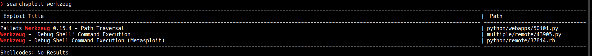

```
searchsploit -m 43905

    Exploit: Werkzeug - 'Debug Shell' Command Execution
        URL: https://www.exploit-db.com/exploits/43905
       Path: /usr/share/exploitdb/exploits/multiple/remote/43905.py
      Codes: N/A
   Verified: False
  File Type: Python script, ASCII text executable
  Copied to: /path/43905.py
```

Now that we have the script/exploit I ran it, but it didn't work because it looks for a path called "/console", and this path doesn't exist. Let's move on to the next one with `msfconsole`:

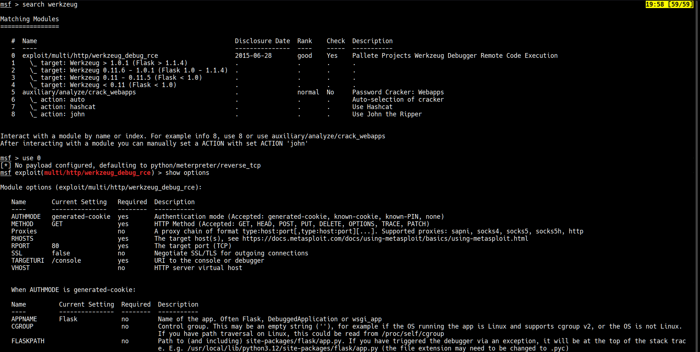

Once againt, we tried in `msfconsole` but it failed because of something called "secret" (I don't know if it is a path or anything else) that doesn't exist, we're still investigating...

After reading the CVE in detail, we can perform an XSS attack. I tried triggering a small `alert()` in the feedback field, and nothing happened:

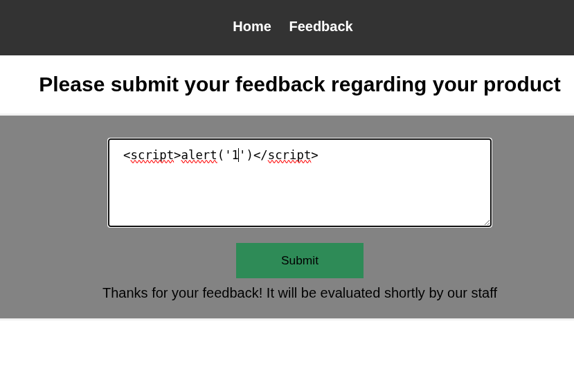

Perfect, this opens up a lot of possibilities for extracting information. In this case, I'll try to go directly for the `/flag.txt` file instead of using the "debugger" as suggest by the CVE:

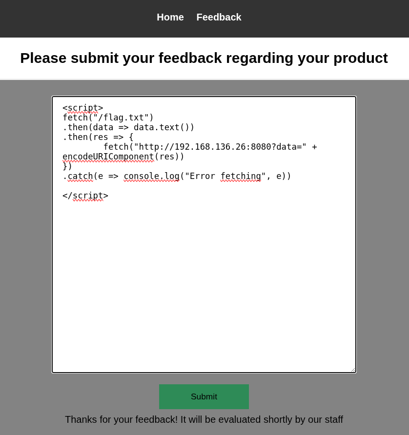
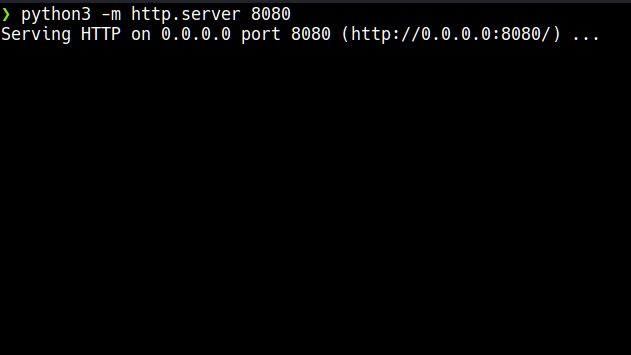

Bingo! As i suspected, there's a bot running in the background that accesses our malicious payload and executes it. Now let's see the result:

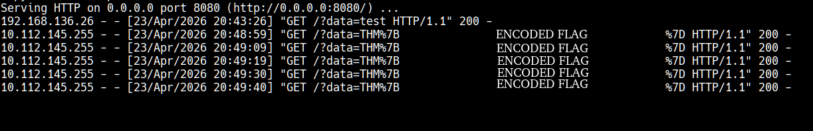

One we receive it, we decode using `javascript` (since we're already doing that):

```javascript
let response = "ENCODED FLAG"
console.log(decodeURIComponent(response))
```

Then
```
node script.js
```

¡Listo! We've finally done it.

[*← Back to index*](../../README.md)