[*← Back to index*](../../README.md)

# Valley

This Write-up/Walkthrough provides my process for the **Valley** *(THM)* CTF. Here you will find the solution for the machine. I encourage you to use this as a reference, not a direct solution.

---

## Scan

Let's start with the scan:

```bash
nmap -p- --open --min-rate 5000 -sS -Pn -n -vvv 10.113.138.190

  22/tcp    open  ssh     syn-ack ttl 62
  80/tcp    open  http    syn-ack ttl 62
  37370/tcp open  unknown syn-ack ttl 62

###

nmap -p22,80,37370 -sV -sC 10.113.138.190

  PORT      STATE SERVICE VERSION
  22/tcp    open  ssh     OpenSSH 8.2p1 Ubuntu 4ubuntu0.5 (Ubuntu Linux; protocol 2.0)
  | ssh-hostkey: 
  |   3072 c2:84:2a:c1:22:5a:10:f1:66:16:dd:a0:f6:04:62:95 (RSA)
  |   256 42:9e:2f:f6:3e:5a:db:51:99:62:71:c4:8c:22:3e:bb (ECDSA)
  |_  256 2e:a0:a5:6c:d9:83:e0:01:6c:b9:8a:60:9b:63:86:72 (ED25519)
  80/tcp    open  http    Apache httpd 2.4.41 ((Ubuntu))
  |_http-server-header: Apache/2.4.41 (Ubuntu)
  |_http-title: Site doesn't have a title (text/html).
  37370/tcp open  ftp     vsftpd 3.0.3
  Service Info: OSs: Linux, Unix; CPE: cpe:/o:linux:linux_kernel
```

I found 3 ports opened:

  * **22**: SSH
  * **80**: HTTP → Apache httpd 2.4.41
  * **37370**: FTP → vsftpd 3.0.3

---

## Pasive recognition

I usually use `whatweb` to get a better understanding of the website architecture.

```bash
whatweb 10.113.138.190

  ERROR Opening: https://10.113.138.190 - Connection refused - connect(2) for "10.113.138.190" port 443
  http://10.113.138.190 [200 OK] Apache[2.4.41], Country[RESERVED][ZZ], HTML5, HTTPServer[Ubuntu Linux][Apache/2.4.41 (Ubuntu)], IP[10.113.138.190], Script
```

According to "launchpad" the OpenSSH 8.2p1 Ubuntu 4ubuntu0.5 is part of Ubuntu focal, which focuses on stability, security and long-term support.

https://launchpad.net/ubuntu/+source/openssh/1:8.2p1-4ubuntu0.5

Let's go to the website

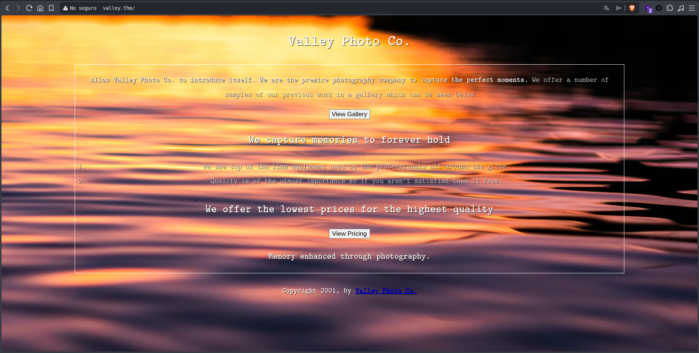

Looking at the source code of the main HTML, I notice that redirects to the page's routes are handled via a "button" that executes `Javascript` code using `window.location`

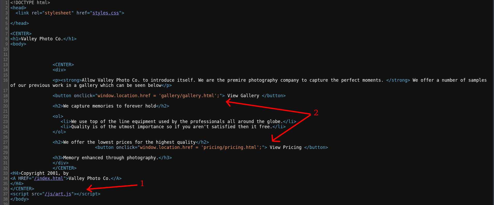

*The numbers will be explained later*

The "pricing" page doesn't show anything interesting...

At this point, I can say that te entire front-end is dynamically generated from back-end since it uses the same template; after all, we're working with PHP on Apache.

Explaining the main page source code:

  1. If we navigate to the script's URL "/js/art.js", it returns a 404 status code, the script doesn't exists.
  2. Remember when we talked about how the URLs are structured in a strange way? I decided to check both of them out. `/gallery` doesn't show anything, but `/pricing` does have something interesting:

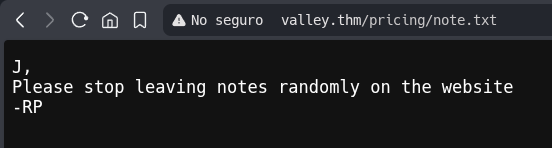

We'll take this one to our machine:

```bash
wget http://valley.thm/pricing/note.txt
```

So we have two possibles users: "J" and "RP"

I can't find anything else on the page right now, so let's dig a little deeper.

```bash
gobuster dir -u http://valley.thm -w /usr/share/wordlists/dirb/common.txt -t 100 -r -q

  .htaccess            (Status: 403) [Size: 275]
  .htpasswd            (Status: 403) [Size: 275]
  .hta                 (Status: 403) [Size: 275]
  gallery              (Status: 200) [Size: 943]
  index.html           (Status: 200) [Size: 1163]
  pricing              (Status: 200) [Size: 1137]
  server-status        (Status: 403) [Size: 275]
  static               (Status: 200) [Size: 564]
```

There's something strange going on here. `gobuster` tells me that the `/static` path has a size of 564 but if we try to access it, it doesn't display any content:

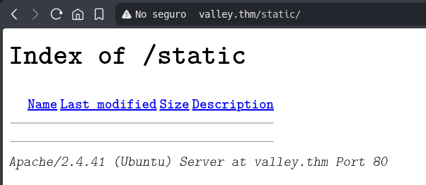

As yoy can see, there aren't 564 characters there. Let's take a closer look:

```bash
gobuster dir -u http://valley.thm/static -w /usr/share/wordlists/dirb/common.txt -t 100 -r -q -x php,html,txt,png,jpeg,jpg,
❯ gobuster dir -u http://valley.thm/static -w /usr/share/wordlists/dirb/common.txt -t 100 -r -q -x php,html,txt,png,jpeg,jpg,json,yaml,env,js,css,map --xl 275

  00                   (Status: 200) [Size: 127]
  11                   (Status: 200) [Size: 627909]
  3                    (Status: 200) [Size: 421858]
  12                   (Status: 200) [Size: 2203486]
  10                   (Status: 200) [Size: 2275927]
  14                   (Status: 200) [Size: 3838999]
  15                   (Status: 200) [Size: 3477315]
  1                    (Status: 200) [Size: 2473315]
  13                   (Status: 200) [Size: 3673497]
  2                    (Status: 200) [Size: 3627113]
  6                    (Status: 200) [Size: 2115495]
  5                    (Status: 200) [Size: 1426557]
  9                    (Status: 200) [Size: 1190575]
  7                    (Status: 200) [Size: 5217844]
  8                    (Status: 200) [Size: 7919631]
  4                    (Status: 200) [Size: 7389635]
```

Just as I thought. `gobuster` gave me a good result; as we saw in the source code , the fotos are numbered up to 18, but `gobuster` also found "00" — let's take a look:

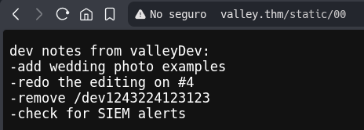

So there are a few things the developers need to fix; two of them stand out to me:

The first thing to note is the unusual path /dev1243224123123 (we'll revisit this). The second is that the machine has a SIEM actively monitoring traffic — meaning our nmap and gobuster scans were likely logged. Once we gain access, we'll need to assess whether we can clear those logs without leaving a trace.

Let's go to path we found:

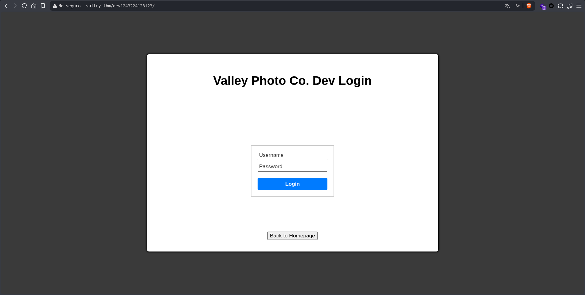

So we're looking at a login page. We already have two possibles usernames, though they're just initials. Lets see what other information we can extract, the first thing I do is check the source code where I find two very interesting scritps `dev.js` and `button.js`

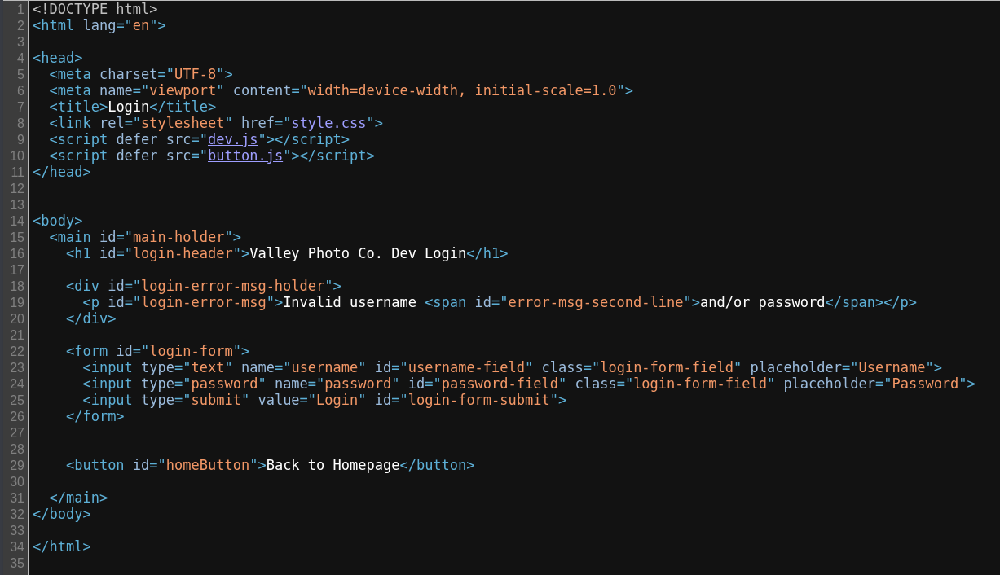

We visited `dev.js` and found the credentials to log in:

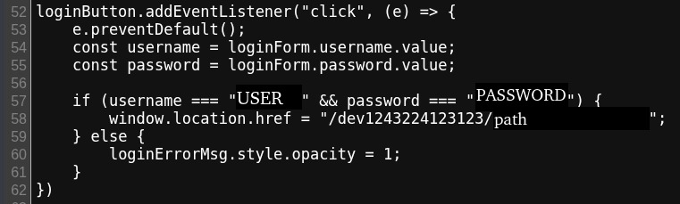

Once we are loged in, it take us directly to a file `.txt`

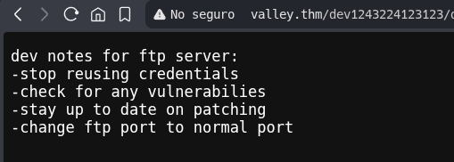

**NOTE:** *I'm hidding the file's name path because the script has no security measures in place, so it could be accessed without credentials. The idea is suggest an alternative soltuion, not to provide the answers.*

Perfect, they're telling us about the FTP port running on 37370. I hadn't forgotten about it; so far, we're in passive reconnaissance phase, looking for clues to gain access to the machine.

---

## Active recognition

Perfect, from here we'll connect via FTP service on port 37370. First, I'll use the tool I've made available on a [Github repository](https://github.com/PFPE20/find_commands), which I use to keep track of my notes on packages, services, programming languages, exploits, etc. Then I'll connect via FTP.

At this point I'd like to remind you that loggin in via FTP is part of active reconnaissance, since packets are being sent and connections are being established. I'd also like to remind you that our connection may be logged by the SIEM — do you remember that?

Hmmm... I tried loggin in as "Anonymous", and it didn't work, but I can't say I didn't know that, since it didn't show up as available in the service scan with nmap.

```bash
ftp 10.113.138.190 37370

Connected to 10.113.138.190.
220 (vsFTPd 3.0.3)
Name (10.113.138.190:User): Anonymous
331 Please specify the password.
Password: 
530 Login incorrect.
ftp: Login failed
```

Great, we use the credentials we found exposed in the JS script and managed to log in:

```bash
ftp 10.113.138.190 37370
Connected to 10.113.138.190.
220 (vsFTPd 3.0.3)
Name (10.113.138.190:User): USERNAME
331 Please specify the password.
Password: 
230 Login successful.
Remote system type is UNIX.
Using binary mode to transfer files.
ftp> ls -la
229 Entering Extended Passive Mode (|||58295|)
150 Here comes the directory listing.
dr-xr-xr-x    2 1001     1001         4096 Mar 06  2023 .
dr-xr-xr-x    2 1001     1001         4096 Mar 06  2023 ..
-rw-rw-r--    1 1000     1000         7272 Mar 06  2023 siemFTP.pcapng
-rw-rw-r--    1 1000     1000      1978716 Mar 06  2023 siemHTTP1.pcapng
-rw-rw-r--    1 1000     1000      1972448 Mar 06  2023 siemHTTP2.pcapng
226 Directory send OK.
ftp> get siemFTP.pcapng
local: siemFTP.pcapng remote: siemFTP.pcapng
229 Entering Extended Passive Mode (|||40019|)
150 Opening BINARY mode data connection for siemFTP.pcapng (7272 bytes).
100% |************************************************************************************************************************************************|  7272      123.46 KiB/s    00:00 ETA
226 Transfer complete.
7272 bytes received in 00:00 (49.73 KiB/s)
ftp> get siemHTTP1.pcapng
local: siemHTTP1.pcapng remote: siemHTTP1.pcapng
229 Entering Extended Passive Mode (|||18922|)
150 Opening BINARY mode data connection for siemHTTP1.pcapng (1978716 bytes).
100% |************************************************************************************************************************************************|  1932 KiB  739.92 KiB/s    00:00 ETA
226 Transfer complete.
1978716 bytes received in 00:02 (716.73 KiB/s)
ftp> get siemHTTP2.pcapng
local: siemHTTP2.pcapng remote: siemHTTP2.pcapng
229 Entering Extended Passive Mode (|||63408|)
150 Opening BINARY mode data connection for siemHTTP2.pcapng (1972448 bytes).
100% |************************************************************************************************************************************************|  1926 KiB  928.23 KiB/s    00:00 ETA
226 Transfer complete.
1972448 bytes received in 00:02 (887.83 KiB/s)
```

Nice, now we have a SIEM that captures network traffic, let's analyze it with `wireshark`

  1. `.pcapng` file of the FTP prococol:

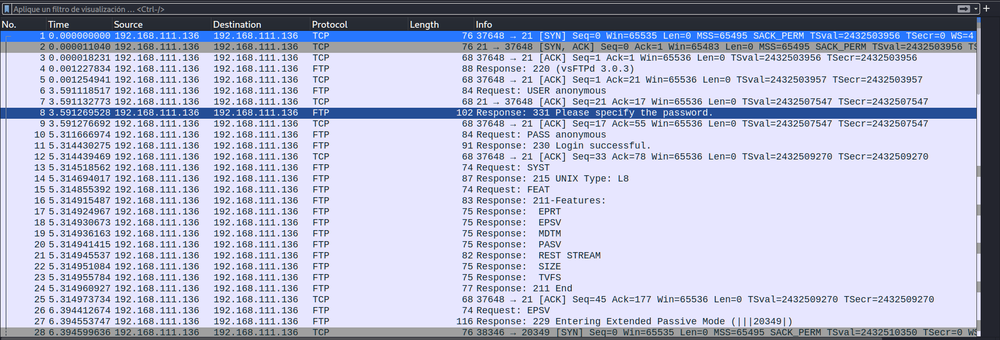

  **NOTE**: Fortunately, our IP address isn't logged. The SIEM must not be running (I hope)

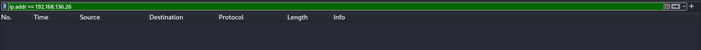

  Looking a little more closely at what actually did the person who came in, they didn't really do much to follow this protocol.

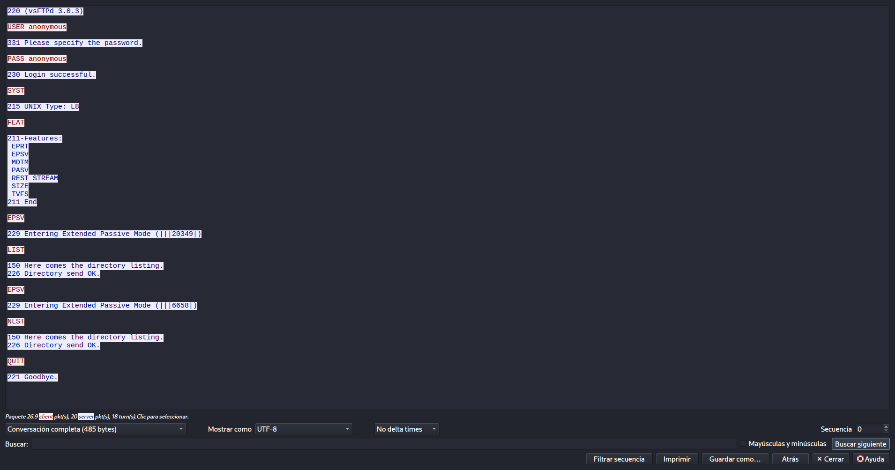

  2. `.pcapng` file of the HTTP1 protocol:

  Now, let's take a look at the file with HTTP(1) protocol:

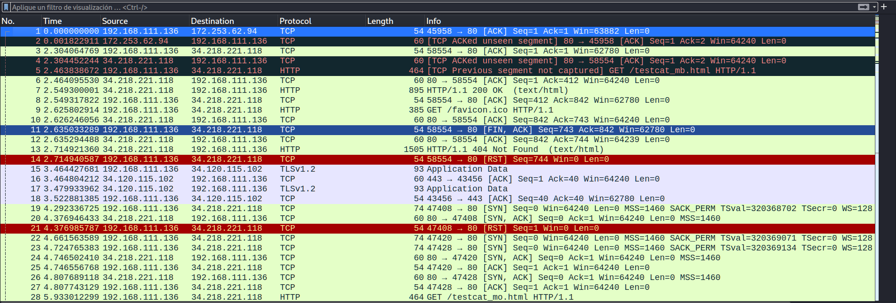

  After searching for a while, I realized that this packet is just "filler" — there's nothing interesting about it. The only thing I could gather from this was that the person generating this network traffic used a call service (I assume via the QUIC protocol, here's a link so you can learn a bit about it, just like I did: [QUIC Protocol](https://www.geeksforgeeks.org/javascript/quic-protocol/)) and was trying to access Google and Wikipedia using `curl` Let's move on

  3. `.pcapng` file of the HTTP(2) protocol:

  Let's take a look at the second one:

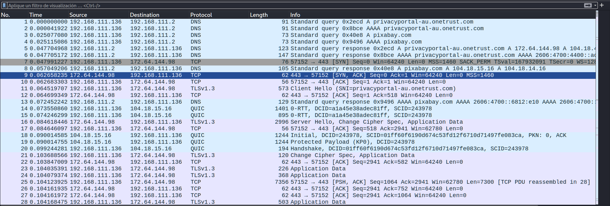

  We filter by HTTP protocol and can see the responses after the "three-way-handshake". The first is the request to the `/index` path, the second is a **POST** that contains `Content-Type: x-www-form-urlencoded` header. We need to filter this one and we'll see certain credentials:

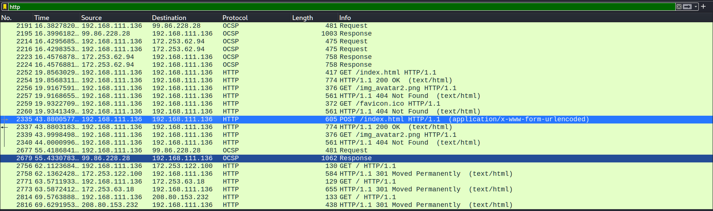
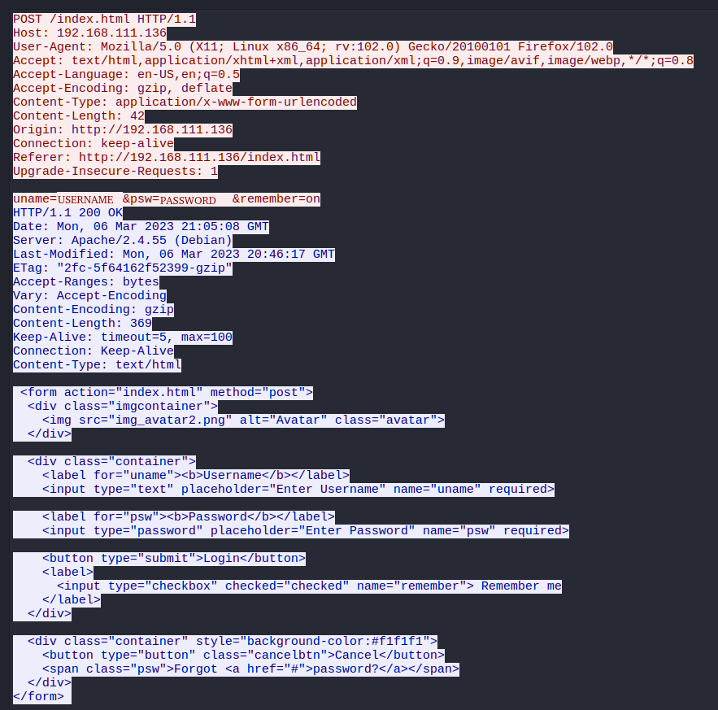

Perfect, we have credentials, let's see where the might come in handy. I'd like to point out that the same IP address has appeared making requests and sending/receiving packets in all three files we analyzed. Let's continue.

Just out of curiosity, I tried entering those credentials into the path we found in the machine HTTP's protocol (knowing it wouldn't work), and it didn't work. Next step: I tried it directly in the SSH protocol on port 22, and we managed to log in:

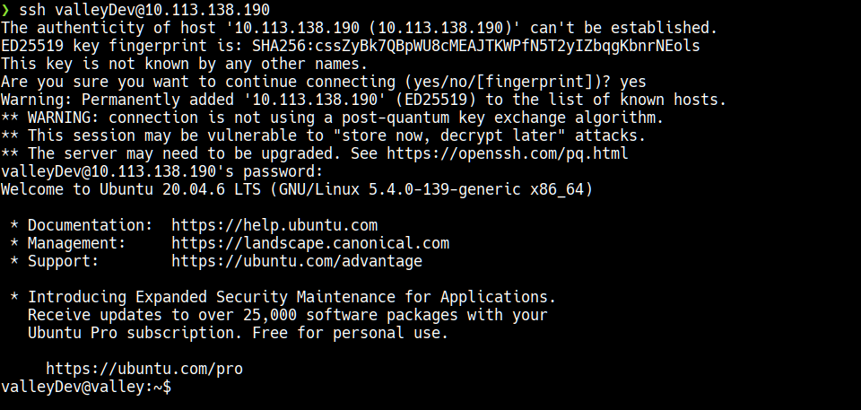

As I mentoned it, this is a Ubuntu focal:

```bash
valleyDev@valley:~$ whoami
valleyDev
valleyDev@valley:~$ uname -a
Linux valley 5.4.0-139-generic #156-Ubuntu SMP Fri Jan 20 17:27:18 UTC 2023 x86_64 x86_64 x86_64 GNU/Linux
valleyDev@valley:~$ lsb_release -a
No LSB modules are available.
Distributor ID: Ubuntu
Description:    Ubuntu 20.04.6 LTS
Release:        20.04
Codename:       focal
```

We obtain the first flag:

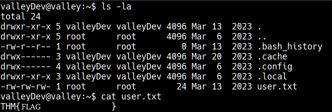

Ok, I looked through the `.pncap` files and couldn't find them, but we were able to confirm that our IP address isn't in them. For now, there's no record in the SIEM that we've logged (or at least not this one). Then I discovered that there's a directory called **"photos"** in the root directory; we'll leave it at that for now.

If we go to the `/home` directory, we'll find a binary:

```bash
valleyDev@valley:~$ cd /home/
valleyDev@valley:/home$ ls -la
total 752
drwxr-xr-x  5 root      root        4096 Mar  6  2023 .
drwxr-xr-x 21 root      root        4096 Mar  6  2023 ..
drwxr-x---  4 siemDev   siemDev     4096 Mar 20  2023 siemDev
drwxr-x--- 16 valley    valley      4096 Mar 20  2023 valley
-rwxrwxr-x  1 valley    valley    749128 Aug 14  2022 valleyAuthenticator
drwxr-xr-x  5 valleyDev valleyDev   4096 Mar 13  2023 valleyDev
valleyDev@valley:/home$ file valleyAuthenticator 
valleyAuthenticator: ELF 64-bit LSB executable, x86-64, version 1 (GNU/Linux), statically linked, no section header
```

I tried to analyze it with `ltrace` but it is statically linked, so it throws an error:

```bash
valleyDev@valley:/home$ ltrace ./valleyAuthenticator 
Couldn't find .dynsym or .dynstr in "/proc/2101/exe"
```

To read more about this: https://stackoverflow.com/questions/26541049/ltrace-couldnt-find-dynsym-or-dynstr-in-library-so

Let's try running it normally: 

```bash
valleyDev@valley:/home$ ./valleyAuthenticator 
Welcome to Valley Inc. Authenticator
What is your username: USERNAME
What is your password: PASSWORD
Wrong Password or Username
```

Ok, it doesn't accepts the current user's credentials either.

Let's try with `strace`:

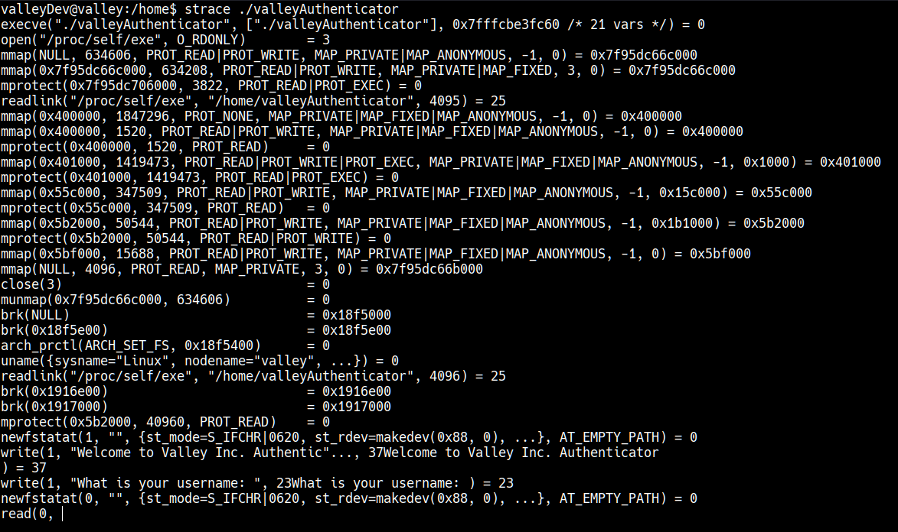

Looking closely, we can see a user account named **valley** that also belongs to this machine. Since I'm not yet satisfied with this information, I need to examine this binary file more thoroughly, so I retrieve it using the SCP protocol.

```bash
sudo scp valleyDev@10.113.138.190:/home/valleyAuthenticator .
[sudo] contraseña para User: 
** WARNING: connection is not using a post-quantum key exchange algorithm.
** This session may be vulnerable to "store now, decrypt later" attacks.
** The server may need to be upgraded. See https://openssh.com/pq.html
valleyDev@10.113.138.190's password: 
valleyAuthenticator
```
Ok, we have the file, I analyzed it a bit with `ghidra`, but since it's statically compiled, `ghidra` can't recognize many variables and functions. So, after searching a bit through generic CLIB, I found something about **md5**:

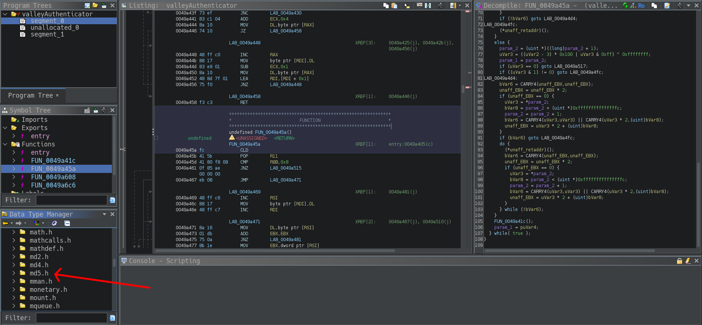

We know that there's an **MD5** hash somewhere in the binary file, I looked for where it asks for credentials and found something interesting:

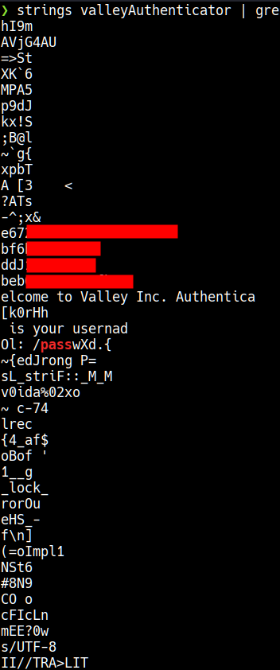

Once I found it, I tried to crack it with `john` but it didn't work, so we go to the old reliable:

> https://crackstation.net/

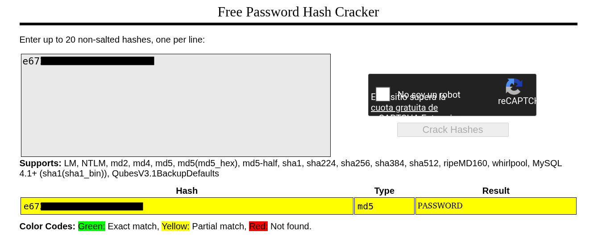

We test the credential we obtained and it works:

```bash
valleyDev@valley:/home$ su valley
Password: 
valley@valley:/home$ whoami
valley
```

Now let's move on to the Python script, but first, we can see that everything in this directory belongs to `root`:

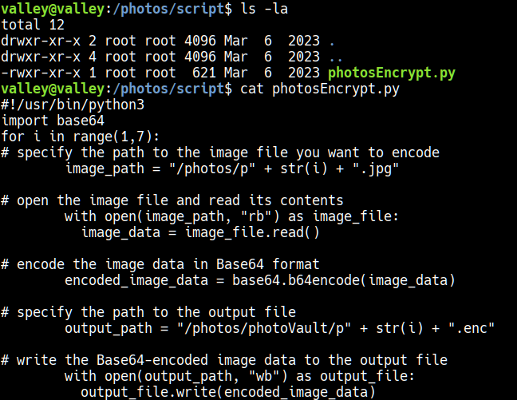

After looking around the system a bit, I found that there's a **cronjob** set up:

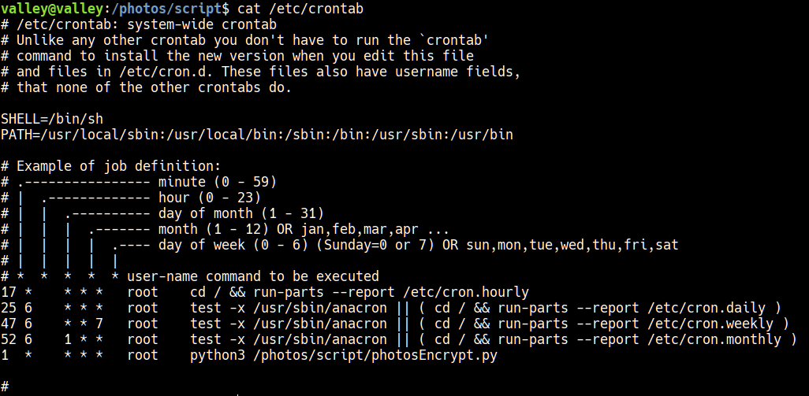

Ok, this script is our only options since the machine won't let us use `sudo -l`, and since we can't edit the script either, I look into modify native Python files and found the following:

https://docs.python.org/3/library/index.html

Then, I searched for vulnerabilities in native modules and found the following:

https://magev0.github.io/2025/07/12/abusing-python-for-privesc/

Hands on:

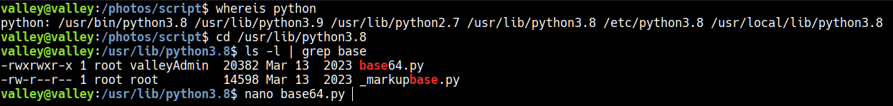
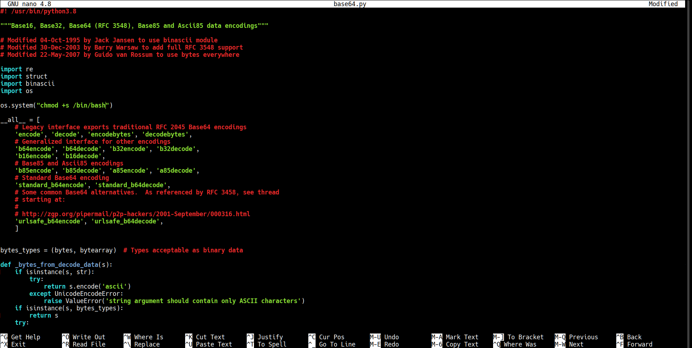

Once 1 minute has passed since the change (remember the cronjob), we can do the following:

```bash
bash -p

bash-5.0# whoami
root
bash-5.0# cat /root/root.txt
```

[*← Back to index*](../../README.md)